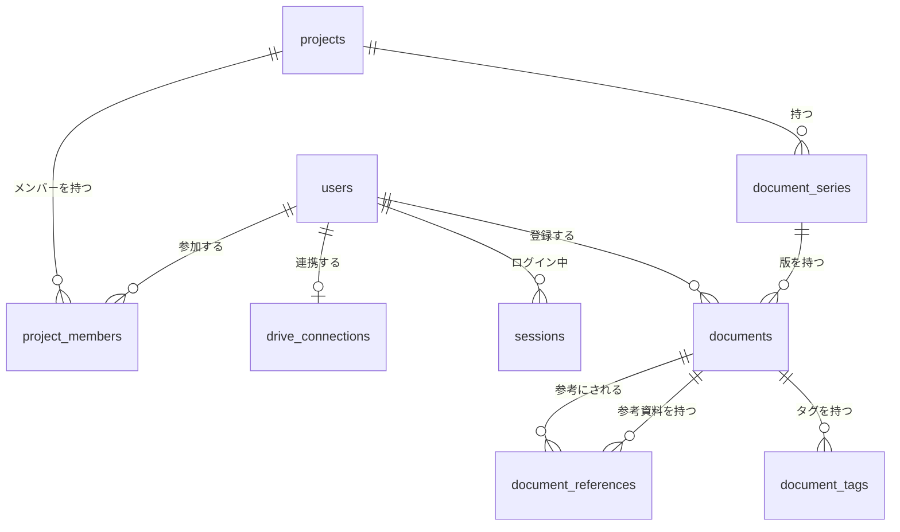

# System Design Doc — weaponx

画面の存在・目的・レイアウト・振る舞い・文言は `docs/design-spec.md`(以下 design-spec)が所有する。このドキュメントは、それを実現する技術(アーキテクチャ、API、データモデル、セキュリティ、運用の設計)を所有する。

---

## 1. Goal / Non-Goal

### Goal

- design-spec の MVP(案件・資料・版・参考資料・変更メモ・タグ・横断検索・メンバー管理・利用者管理・ドライブでの作成とコピー)を、日英2言語で動かす
- ロードバランサーの後ろでアプリを複数台で動かしても正しく動く。セッションと同時操作の整合性(design-spec 6.0.6)はデータベースで守り、アプリのメモリには正しさに関わる状態を持たない
- Google の審査なしで、会社の Google Workspace のアカウントと個人の Gmail の両方が使える(ドライブの許可は `drive.file` だけ)
- 1人で運用できる。構成はすべて Terraform とリポジトリで再現でき、デプロイは `deploy/production/version` の更新だけで行う
- 固定費は月 $40 前後に収める

### Non-Goal

- プロダクトとして作らないもの: `docs/01_prd.md` 6章
- 技術面で持たないもの: リアルタイム通信の基盤(WebSocket・SSE)、ステージング環境、複数リージョン、ゼロダウンタイムを保証するマイグレーション基盤(ADR-016)、design-spec 1.2 の想定規模を超える性能の最適化

---

## 2. アーキテクチャ概要

```
                         ┌──────────────────────── GCP (asia-northeast1 + グローバル LB) ────────────────────────┐
[ブラウザ]                │                                                                                        │
  React SPA ──HTTPS──▶ [外部アプリケーション ロードバランサー]  weaponx-lb(証明書: Google マネージド)             │
  (Eden Treaty)        │     │  URL マップ                                                                        │
       │               │     ├─ /api/*           ─▶ [Cloud Armor] ─▶ サーバーレス NEG ─▶ [Cloud Run: weaponx-api]  │
       │               │     │                                                        (Bun + Elysia, 0〜3台)     │
       │               │     │                                                              │                  │
       │               │     └─ それ以外         ─▶ バックエンドバケット(Cloud CDN)          │ Unix ソケット      │
       │               │                           [Cloud Storage: {PROJECT_ID}-weaponx-web]  ▼                  │
       │               │                           (index.html, assets/)             [Cloud SQL: weaponx-db]    │
       │               │                                                              PostgreSQL 16             │
       │               │  [Secret Manager] ─(起動時に環境変数へ)─▶ weaponx-api                                   │
       │               │  [Cloud Run ジョブ: weaponx-migrate](マイグレーション・初期管理者の登録)               │
       │               │  [Artifact Registry: weaponx] [Cloud Logging / Monitoring / Error Reporting]            │
       │               └────────────────────────────────────────────────────────────────────────────────────────┘
       │                                          │
       └── Google Picker(ブラウザ) ──────────────┼──▶ [Google OAuth 2.0] [Google Drive API v3]
                                                  └── weaponx-api からサーバー間で呼ぶ
```

### 通信フロー

| 流れ | 経路 |
|------|------|
| 画面の読み込み | ブラウザ → LB → バックエンドバケット。`/assets/*` はそのまま、それ以外のパス(`/`, `/projects/...` 等)は URL マップで `/index.html` に書き換える(SPA のフォールバック)。キャッシュの方針は7章「パフォーマンス」 |
| API | ブラウザ(Eden Treaty)→ LB → Cloud Armor(レート制限)→ Cloud Run。セッションは Cookie、状態は PostgreSQL。どのインスタンスに振り分けられても同じ結果になる |
| ログイン | ブラウザ → `/api/auth/google/login` → Google の同意画面 → `/api/auth/google/callback` → セッション作成 → 元の URL(5.2) |
| ドライブ操作 | Cloud Run → Google Drive API v3(REST)。リフレッシュトークンは暗号化して `drive_connections` に保存し、アクセストークンは Cloud Run のインスタンスのメモリにだけキャッシュする(失っても取り直すだけ。ADR-013) |
| ファイル選択画面 | ブラウザ → `/api/drive/picker-token` で短命のアクセストークンを受け取り、Google Picker を開く。選んだファイルは `drive.file` でアプリが使えるようになる(ADR-011) |
| DB | Cloud Run 組み込みの Cloud SQL 接続(Unix ソケット `/cloudsql/{接続名}`)。パブリック IP の承認済みネットワークは空にし、外から直接つながない |

同じオリジン(`https://{DOMAIN}`)に画面と API を置くので、CORS は使わない。

### インフラ管理

- GCP のリソースはすべて Terraform(`infra/`)で管理する。state は GCS バケット `{PROJECT_ID}-tfstate`
- Terraform で作らないもの: GCP プロジェクトと課金の紐付け、tfstate バケット、OAuth 同意画面と OAuth クライアント、Picker 用 API キー、Secret Manager の値(シークレットの入れ物は Terraform、値は `gcloud` で入れる。state に値を残さないため)。手順は `docs/04_deployment-procedure.md`
- 構成の概算(月): LB の転送ルール 約 $18、Cloud Armor 約 $7、Cloud SQL(db-f1-micro、10GB)約 $11、Cloud Run・Cloud Storage・CDN・Secret Manager・Artifact Registry 合計 約 $1〜3。合計 約 $37〜40

---

## 3. 技術選定と判断理由(ADR)

### ADR-001: アプリの形は「SPA + 独立 API」、同じオリジンに置く

**決定:** 画面は React の SPA、API は Elysia のサーバーとして分ける。どちらもロードバランサーの後ろの同じドメインに置き、パス(`/api/*` とそれ以外)で振り分ける。画面の静的ファイルは Cloud Storage から配る。

**理由:** API に Elysia を使うこと(ADR-003)が利用者の希望で、React のフルスタック FW(Next.js 等)とは同居させにくい。案件画面は横パネル・絞り込み・タグ入力・URL への選択状態の反映など、画面側の状態が多く、SPA が向く。同じオリジンにすれば CORS が要らず、Cookie のセッションをそのまま使える。静的ファイルを CDN 付きのバケットから配ると、Cloud Run が冷えていても画面の読み込みは待たされない。

**トレードオフ:** 画面と API を別々に配る(Cloud Storage と Cloud Run)ので、デプロイで順番を守る必要がある(`docs/04_deployment-procedure.md` 2章)。SEO は捨てる(ログイン必須のアプリなので不要)。捨てた案: Next.js 等のフルスタック FW(Elysia と同居させにくい)、Elysia が SPA の静的ファイルも配る1サービスの構成(デプロイの順番の問題は無くなるが、最小インスタンス0だと冷えた状態からの起動の遅れが画面の読み込みにも出る。CDN も API と同じ経路になり、ロードバランサーでパスを振り分ける意味が薄れる)。

### ADR-002: 言語は TypeScript、実行環境は Bun、1つのリポジトリにまとめる

**決定:** API・画面・共有コードを TypeScript で書き、Bun のワークスペースで1つのリポジトリにまとめる(`apps/api`、`apps/web`、`packages/shared`)。Google の API は公式 SDK(googleapis)を使わず、`fetch` で REST を直接呼ぶ。

**理由:** Elysia は Bun 向けに作られている。入力の上限・名前の正規化・リンクの種別判定・エラーコードを `packages/shared` に置き、画面と API で同じ規則を使える(design-spec 6.0.3・6.0.4)。Eden Treaty(ADR-004)は API の型を画面から import するので、同じリポジトリにあると素直に使える。使う Drive API は数本(ファイルの取得・作成・コピー)なので、SDK の大きな依存を持ち込まない。

**トレードオフ:** Node.js 専用のライブラリの一部は Bun で動かないことがある。Playwright は Node.js で動かす(公式の Docker イメージを使う。ADR-021)。捨てた案: Node.js で動かす(Elysia には Node 用のアダプターがあるが、Bun 向けの速さと組み込みのテストランナー・パッケージ管理を活かせない)、API と画面でリポジトリを分ける(`packages/shared` と Eden の型を共有しにくい)。

### ADR-003: API のフレームワークは Elysia.js

**決定:** API は Elysia.js で書く。入力の検証は Elysia 組み込みの TypeBox(`t`)を使う。

**理由:** 利用者の希望。Bun のネイティブな HTTP サーバーの上で速く動き、ルートの型から画面側の型付きクライアント(Eden Treaty、ADR-004)を作れる。TypeBox は Elysia の標準で、検証のスキーマがそのまま型と Eden の入出力の型になる。

**トレードオフ:** Hono・Express に比べてエコシステムが小さく、事例が少ない。Bun 以外で動かす道は細い。TypeBox は Zod より書き方が冗長で、画面のフォームでは直接使いにくい(画面の即時の検証は `packages/shared` の定数と関数で行う)。捨てた案: Hono(軽くどこでも動くが、利用者の希望ではない)、NestJS(1人開発には構造が重い)、検証に Zod(Elysia でも使えるが、標準の TypeBox の方が Eden の型とずれない)。

### ADR-004: 通信方式は REST(JSON)+ Eden Treaty

**決定:** API は REST 風の JSON API にし、画面からは Eden Treaty(Elysia 公式の型付きクライアント)で呼ぶ。リアルタイム通信(WebSocket・SSE)は持たない。

**理由:** 画面専用の API なので、ルートの型を画面と共有できれば十分。Eden を使うと、API の入出力の型がそのまま画面に届き、API 設計(5章)と実装のずれをコンパイル時に見つけられる。design-spec にリアルタイム要件はない(6.0.6 は後勝ち)。

**トレードオフ:** 画面が API の型に直接依存するので、API を変えると画面も同じコミットで直す必要がある(同じリポジトリなので問題にならない)。捨てた案: tRPC(Elysia では Eden が同じ役割を果たす)、GraphQL(画面が少なく、過剰)。

### ADR-005: 画面は React + Vite + TanStack Router / Query + Tailwind CSS + Radix UI

**決定:** React(Vite でビルド)、ルーティングは TanStack Router、サーバーの状態は TanStack Query、見た目は Tailwind CSS v4、ダイアログ・メニュー・ポップオーバーは Radix UI のプリミティブで作る。

**理由と捨てた案(部品ごと):**

| 部品 | 理由 | 捨てた案 |
|------|------|---------|
| React | 部品と周辺ライブラリ(TanStack・Radix・i18next)が最もそろい、AI での実装の事例も多い | Vue・Svelte(小さく書けるが、上の周辺ライブラリの組み合わせが薄い) |
| Vite | SPA のビルドと開発サーバーの標準。Bun の上でも動く | Bun の組み込みバンドラー(開発サーバーと HMR がまだ Vite ほど枯れていない) |
| TanStack Router | URL の検索パラメーター(選んだ系列・版、検索語)を型付きで扱える(design-spec 6.1「URL にも選んだ系列と版を反映」) | React Router(検索パラメーターの型付けが弱い) |
| TanStack Query | 操作の後の再読み込み(design-spec 6.0.1・6.0.2)を、キャッシュの無効化として宣言的に書ける | SWR(変更系の扱いが薄い)、自前の状態管理 |
| Tailwind CSS v4 | `@theme` で `docs/06_design-tokens.json` から生成した CSS 変数をそのまま使える(ADR-020)。高密度の表を少ない記述で組める | CSS Modules(トークンは使えるが、高密度の表の記述量が増える)、MUI 等の部品ライブラリ(下のトレードオフ) |
| Radix UI | ダイアログのフォーカス管理・Esc キー・背面の操作不可(design-spec 4.1 のパターン D)を正しく扱える。見た目を持たないので Tailwind と組み合わせやすい | Headless UI(部品の種類が少ない) |

**トレードオフ:** 部品ライブラリ(MUI 等)を使わないので、表やタグ入力は自作する。見た目の自由度と高密度の表(design-spec 4.4)を優先した。

### ADR-006: クラウドは GCP(asia-northeast1、Cloud Run)

**決定:** GCP の Cloud Run(API)、Cloud Storage(画面)、Cloud SQL(DB)、外部アプリケーション ロードバランサーで動かす。リージョンは asia-northeast1(東京)。

**理由:** ロードバランサーを自分で組む構成(利用者の希望)を、Cloud Run のサーバーレス NEG で素直に作れる。Google ログインとドライブ連携の設定(OAuth 同意画面・クライアント・Picker の API キー)はどのクラウドを選んでも GCP で行うので、管理画面を1つにまとめられる。Cloud Run は使った分だけの課金で、アイドル時はほぼ無料。利用者は日本にいるので、東京リージョンで遅延を小さくする。

**トレードオフ:** ロードバランサーの転送ルールに月 約 $18 の固定費がかかる(Cloud Run の既定 URL だけなら不要な費用)。東京は us-central1 より単価が少し高い(この規模では月 $1〜2 の差)。捨てた案: AWS(ALB + ECS Fargate + RDS。実績とサービスの幅は最大だが、止まらない構成で月 $50〜100、Google の設定のために GCP にも触る)、Fly.io(月 $5〜10 と安いが、ロードバランサーが組み込みで、自分で組む構成にならない)。GCP の中では GKE Autopilot・Compute Engine(常に動くノードの費用と運用が要る。この規模では Cloud Run で足りる)。

### ADR-007: ロードバランサーでパスを振り分け、Cloud Armor でレート制限する

**決定:** グローバル外部アプリケーション ロードバランサーを置き、URL マップで `/api/*` を Cloud Run(サーバーレス NEG)へ、それ以外を Cloud Storage のバックエンドバケット(Cloud CDN 有効)へ振り分ける。証明書は Google マネージド、HTTP は HTTPS へ転送する。`/api/*` のバックエンドに Cloud Armor のポリシーを付け、IP ごとのレート制限をかける。Cloud Run の受信は「内部と Cloud Load Balancing」に限り、`run.app` の URL から直接は呼べなくする。

**理由:** 利用者の希望(「ロードバランサーまで載せたい」)。入口を1つにすることで、同じオリジン(ADR-001)、証明書の自動更新、CDN、レート制限を1か所で扱える。ログインの入口(`/api/auth/*`)は認証前に誰でも叩けるので、アプリより手前で絞る。レート制限をロードバランサーで行えば、Cloud Run が何台になっても IP ごとの数え方がそろう。

**トレードオフ:** Cloud Armor に月 約 $7 かかる。不要と判断したら外せる(アプリ側の制限は持たないので、外すとログインの入口が無制限になる)。SPA のフォールバック(未知のパスを `/index.html` に書き換える)を URL マップのルートルールで書く必要がある。捨てた案: Firebase Hosting の rewrites(同じオリジンと CDN を安く得られるが、ロードバランサーを自分で組む希望に合わず、Cloud Armor を付けられない)、Cloud Run のドメインマッピング(同上。パスの振り分けもできない)、アプリの中でのレート制限(複数台では台ごとに数えることになり、共有するには Redis 等が要る。1章の「メモリに正しさに関わる状態を持たない」に合わない)。

### ADR-008: DB は Cloud SQL for PostgreSQL 16

**決定:** Cloud SQL(Enterprise、db-f1-micro、SSD 10GB、自動バックアップ7日 + ポイントインタイムリカバリ)を使う。Cloud Run からは組み込みの Cloud SQL 接続(Unix ソケット)でつなぎ、パブリック IP の承認済みネットワークは空にする。版は PostgreSQL 16。

**理由:** 参考資料・版・メンバーの関係と、同時操作の整合性(ADR-013)にはリレーショナル DB のトランザクションと行ロックが要る。アプリと同じクラウドの中でつながり、Terraform で管理できる。VPC を作らずに済み、構成が小さい。版は、ローカル(`postgres:16` のイメージ)・CI と同じものを使い、Drizzle と `pg_trgm` の動作を確かめやすい安定した版にそろえる(17 に上げるのは、動作を確かめてからでよい)。

**トレードオフ:** 使っていなくても月 約 $11 かかる。db-f1-micro は共有 CPU で最大接続数が少ない(約25)ので、接続プールを小さくする(7章)。共有 CPU のマシンは Cloud SQL の SLA の対象外で、メンテナンスで数分止まることがある(自分用の MVP では受け入れる。困ったら専用 CPU のマシンに上げる)。捨てた案: Neon(無料枠があり止まるが、クラウドの外につなぐぶん遅延と管理場所が増える)。

### ADR-009: ORM は Drizzle ORM(ドライバーは postgres.js)、マイグレーションは Cloud Run ジョブで流す

**決定:** スキーマは Drizzle ORM で書き(6章)、マイグレーションは drizzle-kit で SQL ファイルとして生成してリポジトリに置く。ドライバーは postgres.js。本番のマイグレーションは、API と同じイメージの Cloud Run ジョブ `weaponx-migrate` で、デプロイのたびに1回だけ流す(`docs/04_deployment-procedure.md` 2章)。

**理由:** SQL に近い書き方で、行ロック(`FOR UPDATE`)、部分一意インデックス、ウィンドウ関数を素直に書ける。コード生成の工程が無く、Bun で軽く動く。生成されるマイグレーションが SQL なので、レビューしやすい。postgres.js は Drizzle が正式に対応するドライバーの中で、Unix ソケット(Cloud SQL 接続)・トランザクション・接続プールの実績が最も多く、Bun でも動く。マイグレーションを API の起動時に流すと、複数台が同時に流しかねないので、ジョブに分ける。

**トレードオフ:** Prisma に比べて、リレーションをまたぐ取得は自分で書く量が増える。拡張(`pg_trgm`)の作成など、一部は手書きのマイグレーション(`make db-generate CUSTOM=1`)になる。捨てた案: Prisma(コード生成の工程が要り、行ロックや advisory lock は生の SQL になる)、Kysely(型付きの SQL ビルダーとして優秀だが、マイグレーションの生成を持たない)、ドライバーに Bun.sql(Bun 組み込みで速いが、まだ新しく、Cloud SQL の Unix ソケットでの事例が少ない)・node-postgres(Bun での動作報告が postgres.js より少ない)。

### ADR-010: ログインは Google OAuth を自前で扱い(Arctic)、セッションは DB に持つ

**決定:** Google の OAuth 2.0 / OpenID Connect を Arctic(小さな OAuth クライアント)で扱う。ログインでドライブの許可も一緒に求める(design-spec 6.5.1)。セッションは乱数のトークンを Cookie に入れ、DB には SHA-256 のハッシュだけを持つ。有効期限は最後の操作から14日(残り7日を切ったら延長する)。

**理由:** design-spec のデータモデル(管理者が許可したメールだけが入れる `users`、ドライブの認可情報を持つ `drive_connections`)にそのまま合う。セッションが DB にあるので、ロードバランサーの後ろでどのインスタンスに当たっても同じように認証できる。停止された利用者は、次のリクエストで DB の状態を見て即座に弾ける(design-spec 2.1)。

**トレードオフ:** 状態(state)・PKCE・リダイレクト先の検証、リフレッシュトークンの取り扱いを自分で書き、テストする必要がある。捨てた案: Better Auth(組み込みは速いが、独自の利用者・アカウント・セッションの表を持ち、design-spec の `users`・`drive_connections` と二重になる)、Firebase Authentication / Identity Platform(ドライブのリフレッシュトークンを扱えず、別に OAuth を書くことになる)。

### ADR-011: ドライブの許可は `drive.file` だけにし、Google Picker で使えるファイルを増やす

**決定:** 求める範囲は `openid`・`email`・`profile`・`https://www.googleapis.com/auth/drive.file` の4つ。アプリがまだ使えないファイル(ほかの人が登録した資料、リンクを貼っただけの資料)は、Google Picker で選んでもらって使えるようにする(design-spec 6.0.9)。OAuth 同意画面は「外部」「本番」で公開する。

**理由:** 利用者は会社の Workspace のアカウントと個人の Gmail の両方(Phase 3 で確認)。ドライブ全体を読む範囲(`drive.readonly` 等)は Google の「制限付き」範囲で、外部向けに公開するには審査と有料のセキュリティ評価(CASA)が要る。`drive.file` は審査が要らない。同意画面を「テスト」のままにすると、リフレッシュトークンが7日で切れるので「本番」にする。

**トレードオフ:** リンクを貼るだけでは資料名を取れないことが増え、「これを元に作る」の前にコピー元を選ぶ手間が出ることがある(design-spec 6.0.9)。表の資料名の取り直しは、その人が使えるファイルだけになる。捨てた案: `drive.readonly` + 審査(個人の MVP には費用と手間が見合わない)、社内向け(Internal)アプリ(1つの Workspace に限られ、個人の Gmail が使えない)。

### ADR-012: Google のリフレッシュトークンはアプリで AES-256-GCM 暗号化し、鍵は Secret Manager に置く

**決定:** `drive_connections.credentials` にはリフレッシュトークンだけを、AES-256-GCM で暗号化して保存する。形式は `{鍵ID}:{IV}:{暗号文}:{タグ}`(各 base64url)。鍵は環境変数 `TOKEN_ENCRYPTION_KEYS`(Secret Manager から注入)に `{鍵ID}:{base64の32バイト},...` で並べ、先頭を暗号化に使い、すべてを復号に使う。

**理由:** DB のバックアップや SQL が漏れても、トークンだけでは使えないようにする。鍵 ID を付けておくと、鍵を入れ替えるときに古い暗号文も読める。先頭以外の鍵で復号できたときは、先頭の鍵で暗号化し直して保存する(Drive を使うたびに少しずつ入れ替わる。手順は `docs/05_operation-runbook.md` 6章)。暗号化・復号がアプリの中で終わるので、Drive を呼ぶたびに外部サービスを待たない。

**トレードオフ:** 鍵が環境変数としてアプリのメモリに載る。Cloud KMS で毎回復号する案より鍵の保護は弱いが、呼び出しごとの遅延と費用、構成の複雑さを避けた。

### ADR-013: 同時操作の整合性は DB で守り、アプリのメモリに正しさに関わる状態を持たない

**決定:** design-spec 6.0.6 の規則を、次の DB の仕組みで守る。

| 規則 | 仕組み |
|------|--------|
| 版番号の採番 | `UPDATE document_series SET next_version_no = next_version_no + 1 WHERE id = $1 RETURNING next_version_no - 1 AS version_no` で系列の行をロックして採番し、版の追加と同じトランザクションで確定する。系列を作るときは `next_version_no = 2` で作り、最初の版を1番にする |
| リンクの重複 | 部分一意インデックス `(project_id, link_key) WHERE deleted_at IS NULL`。違反(23505)を `DUPLICATE_LINK` に変換する |
| オーナーが1人以上 | 案件の行を `SELECT ... FOR UPDATE` でロックしてから、オーナーの数を数えて変更する |
| 管理者が1人以上 | `pg_advisory_xact_lock` の固定キーで管理者の変更を直列にしてから、有効な管理者の数を数えて変更する(「管理者全体」を表す1行が無いので、行ロックの代わりに使う) |
| 参考資料・タグの件数の上限(design-spec 6.0.3) | 版の行を `FOR NO KEY UPDATE` でロックしてから、数えて書き込む。`FOR UPDATE` にしないのは、参考資料・タグの行を書くときに外部キーが版の行へ取る `FOR KEY SHARE` と、別の版を編集する処理が互いを待つ(デッドロックになる)のを避けるため |
| 資料の登録・編集・削除と、案件の削除・メンバーの変更 | 資料の書き込みは案件の行を `FOR KEY SHARE` でロックしてから役割を確かめる(同じ案件への資料の書き込みどうしは並ぶ)。案件の削除とメンバーの変更は `FOR UPDATE` で、資料の書き込みと直列になる。ロックの順は 案件 → 系列 → 版。版の削除は系列の行も `FOR NO KEY UPDATE` でロックし、新しい版の登録(系列の行ロック)と直列にする |

Google のアクセストークン(1時間有効)だけは、インスタンスのメモリにキャッシュする。失っても、リフレッシュトークンから取り直すだけで結果は変わらない。

**理由:** ロードバランサーの後ろで複数台が同時に処理しても、規則が破れないようにする。守りたい規則はどれも「1つの行(系列・案件・版)か、管理者全体」の単位なので、その単位のロックを取れば、衝突したときも待つだけで、やり直しの処理が要らない(design-spec 6.0.6「後から処理された側は次の番号で成功する」)。

**トレードオフ:** 採番と変更のたびに行ロックを取るので、同じ系列・案件への同時の書き込みは直列になる。この規模では問題にならない。捨てた案: SERIALIZABLE の分離レベル + 再試行(すべての書き込みに再試行の処理が要る)、楽観的ロック(採番や上限の確認が、衝突のたびにやり直しになる)、Memorystore(Redis)の分散ロック(固定費が月 $30 以上かかり、DB と別の整合性を持ち込む)、アプリのメモリの中の排他(複数台では効かない)。

### ADR-014: i18n は react-i18next と JSON の翻訳ファイル

**決定:** 画面の文言は react-i18next で管理し、翻訳ファイルは `apps/web/src/locales/{ja,en}.json`。日時・並べ替えはブラウザの `Intl`(`DateTimeFormat`・`Collator`・`PluralRules`)で行う。API は画面に出す文言を返さず、エラーコードを返す(8章)。詳細は9章。

**理由:** 入れ子のキーの JSON が、画面・部品ごとにキーを分ける設計(9章)にそのまま合い、抽出やコンパイルの工程が要らない。TypeScript でキーに型を付けられ、キーの書き間違いをコンパイル時に見つけられる。英語の単数・複数(design-spec 1.2)は `Intl.PluralRules` に基づく `_one` / `_other` で扱える。

**トレードオフ:** 翻訳ファイルのキーの抜けは実行するまで分からないので、テストで日英のキーの一致を確かめる(10章)。捨てた案: react-intl(ICU メッセージ形式は日英2言語の単純な文言には重い)、Lingui・Paraglide(文言の抽出やコンパイルの工程が要る)。

### ADR-015: IaC は Terraform、state は GCS

**決定:** GCP のリソースは Terraform で管理する。state は GCS のバケット `{PROJECT_ID}-tfstate`(バージョニング有効)に置く。Terraform で作らないもの(プロジェクト、tfstate のバケット、OAuth の設定、秘密の値)は2章「インフラ管理」のとおり。

**理由:** ロードバランサー・Cloud Armor・Cloud SQL・Workload Identity など構成要素が多く、手作業では再現できない。Terraform は GCP の対応が最も厚く、事例が多い。GCS の backend は state のロックを組み込みで持ち、同じプロジェクトの中に置ける。

**トレードオフ:** Terraform の学習と、初回の手作業(`docs/04_deployment-procedure.md` 3章 Step 1)が要る。Cloud Run のイメージはデプロイ(ADR-022)が更新するので、Terraform はイメージの変更を無視する(`lifecycle.ignore_changes`)。捨てた案: Pulumi(TypeScript で書けるが、GCP の事例が Terraform より少ない)、OpenTofu(Terraform とほぼ同じで、選ぶ理由が今は無い)、gcloud のスクリプト(差分の確認と、やり直しの安全さが無い)。

### ADR-016: 環境はローカルと本番の2つ(ステージングは持たない)

**決定:** 環境はローカル(Docker Compose。開発用ログイン + ドライブの模擬。ADR-021)と本番だけにする。本番の前の確認は、ローカルと CI の E2E テストで行う。

**理由:** 自分用の MVP で、利用者は作者と職場の数人。ステージングを作ると、ロードバランサーと DB の固定費がほぼ倍になる。

**トレードオフ:** 本番の Google と Drive でしか確かめられないこと(同意画面・Picker・実際のコピー)は、本番で確かめることになる。リリースの前に確かめる項目は `docs/04_deployment-procedure.md` のチェックリストに置く。マイグレーションは、1つ前の版のアプリでも動く追加的な変更に限る(`docs/04_deployment-procedure.md` 5章)。捨てた案: 同じ LB と Cloud SQL インスタンスに相乗りするステージング(費用は小さいが、本番と設定を分ける手間と、取り違えて本番の DB を触る危険が増える)。

### ADR-017: テストは bun test と Playwright。開発用ログインとドライブの模擬で Google なしに回す

**決定:** 単体・結合テストは `bun test`、画面の部品のテストは `bun test` + Testing Library(happy-dom)、E2E は Playwright。結合テストと E2E は実物の PostgreSQL(Docker)を使う。Google は、開発用ログイン(`DEV_LOGIN_ENABLED=true`)と、ドライブの模擬(`DRIVE_MODE=mock`)に置き換える(design-spec 8章)。

**理由:** 認可の漏れと同時操作の規則は、DB を通さないと確かめられない。Google のアカウントをテストに持ち込まないことで、CI で毎回回せる。bun test は Bun に組み込みで、API・画面・共有コードを1つのテストランナーで回せる。Playwright は複数のタブ(資料を別タブで開く、編集画面を開く)と、トレースでの失敗の調査に強い。

**トレードオフ:** 模擬と本物の Drive API の違いは、本番で確かめるまで残る。模擬は `apps/api/src/drive/` で本物と同じインターフェースを実装し、差を小さくする。捨てた案: Vitest(優秀だが、Bun の組み込みと実行環境が2つになる)、Cypress(複数タブの扱いに制約がある)、本物の Google のテスト用アカウント(2段階認証や同意画面を自動化できず、CI で不安定になる)。

### ADR-018: Lint と整形は Biome

**決定:** Lint と整形は Biome に一本化する。

**理由:** 1つの道具・1つの設定ファイルで済み、速い。

**トレードオフ:** ESLint のプラグインの規則は使えない(React Hooks の依存配列の一部の規則、typescript-eslint の型情報を使う規則(浮いた Promise の検出など))。型の問題は `tsc --noEmit`(`make typecheck`)で拾う。捨てた案: ESLint + Prettier(規則は最も豊富だが、2つの道具と設定の組み合わせを保守する手間と、実行の遅さがこの規模に見合わない)。

### ADR-019: 監視は Cloud Logging / Monitoring / Error Reporting に寄せる

**決定:** ログは構造化 JSON を標準出力に出し、Cloud Logging で集める。例外は Error Reporting、稼働監視とアラートは Cloud Monitoring(アップタイムチェックとアラートポリシー)で行う。画面で起きた想定外のエラーは、API の `POST /api/client-errors` に送り、同じ Cloud Logging に残す。Sentry 等の外部サービスは使わない。

**理由:** 追加のアカウントが要らず、Terraform で一緒に管理できる。ログとエラーの置き場所が GCP の中だけになり、資料名などが外部のサービスに出る経路を増やさない(7章「ログ」)。

**トレードオフ:** 画面のエラーは Error Reporting に集めない(集めると、新しいエラーの通知メールに `message` が載り、資料名が GCP の外に出うる)。ソースマップでの復元もせず、圧縮されたスタックのまま Cloud Logging に残し、件数だけをログベースの指標でアラートにする(`docs/05_operation-runbook.md` 2章)。調べるときは手元でビルドの成果物と照らす。捨てた案: Sentry(無料枠があり画面のエラーの集約に強いが、外部に送る経路が増え、アカウントの管理が1つ増える)。

### ADR-020: デザイントークンから CSS 変数を生成する(変換ツールは使わない)

**決定:** `docs/06_design-tokens.json` を正とし、`scripts/gen-tokens.ts`(`make tokens`)で `apps/web/src/styles/tokens.css`(CSS 変数)を生成する。Tailwind の `@theme` はこの CSS 変数を参照する。Style Dictionary 等の変換ツールは使わない。

**理由:** トークンの数が少なく、DTCG 形式のエイリアスを解いて CSS 変数を書き出すだけなら、数十行のスクリプトで足りる。複合型は次のように書き出す: typography → 項目ごとの CSS 変数(`--typography-body-font-size` 等)と同名のユーティリティクラス、shadow → `box-shadow` の値1つ、transition → 時間とイージングの変数。`$extensions.com.weaponx.fontVariantNumeric` はユーティリティクラスの `font-variant-numeric` にする。ダークモードは `prefers-color-scheme` のメディアクエリで切り替える(design-spec 4.4)。

**トレードオフ:** 生成物(`tokens.css`)をリポジトリに入れるので、JSON だけを直して生成を忘れると食い違う。CI で「生成し直して差分が無いこと」を確かめる。

### ADR-021: ローカル開発は Docker Compose に閉じる

**決定:** ローカルの DB・API・画面・E2E・Lint・マイグレーションは、すべて Docker Compose(`compose.yaml`)の中で動かす。手元に要るのは Docker・make・git だけ。`make` の各ターゲットは `docker compose run` / `exec` を呼ぶ薄いラッパーにする。初回のクラウド設定に使う Terraform と gcloud も、`ops` のコンテナで動かす。VS Code 用に Dev Container の設定(`.devcontainer/`、`tools` のコンテナにつなぐ)を置く。

サービスの構成(`db`・`api`・`web`・`tools`・`e2e`・`ops`)は `docs/03_dev-setup.md` 1章。

**理由:** 利用者の希望。Bun・Node.js・Terraform の版を手元でそろえる手間が無くなり、CI(GitHub Actions)も同じ `make` のターゲットで同じコンテナを使うので、手元と CI の差が出ない。`node_modules` はコンテナ(Linux)用に入るので、エディタの型チェックと Biome はコンテナの中で動かすのが確実で、Dev Container でそれを1クリックにする。

**トレードオフ:** Mac ではファイルの変更検知と `bun install` が手元より遅い。リポジトリはバインドマウントで、`node_modules` も手元のディレクトリに Linux 用として入る(手元で `bun install` を実行すると壊れるので、実行しない)。Dev Container は VS Code(と対応するエディタ)でしか使えない。捨てた案: DB だけを Compose に置き、Bun と Node.js は手元に入れる(変更の反映は速いが、手元と CI で版がずれ、利用者の希望にも合わない)、mise 等で手元の版をそろえる(同上。手元の OS の差は残る)。

### ADR-022: CI/CD は GitHub Actions + Workload Identity 連携、リリースは `deploy/production/version` で行う

**決定:** CI/CD は GitHub Actions で行い、GCP への認証はサービスアカウントの鍵を使わず Workload Identity 連携で行う。main へのマージでアーティファクト(API のイメージと画面の静的ファイル)をビルドし、本番へのリリースは `deploy/production/version` を更新する promotion PR のマージをきっかけにする(`docs/03_dev-setup.md` 9章、`docs/04_deployment-procedure.md` 2章)。インフラの変更は `infra.yml` が PR で plan、main へのマージで apply する(手元の `ops` のコンテナで apply するのは初回だけ)。

**理由:** リポジトリが GitHub にあり、CI でも `make` のターゲットと Docker Compose をそのまま使える(ADR-021)。鍵ファイルを GitHub に置かないで済む。マージとリリースを分けるので、main に入れた変更を好きなときに本番に出せ、ファイルを1つ前の値に戻す(promotion PR を revert する)だけでロールバックできる。本番で動いているバージョンが常にリポジトリに記録される。

**トレードオフ:** リリースのたびに promotion PR を1つ作る手間がかかる。捨てた案: Cloud Build(GCP の中で完結するが、PR へのコメントやブランチ保護との連携を自分で組む必要がある)、main へのマージで自動デプロイ(手数は最少だが、ステージングが無い構成ではマージのたびに本番が変わり、出すタイミングを選べない)、git タグでのリリース(本番で動いているバージョンがファイルに残らず、ロールバックもタグの付け直しになる)。

---

## 4. ルーティング

<!-- 画面の存在・目的・レイアウト・認証要否は design-spec.md が所有する。ここはルートと画面の対応だけを持ち、転記しない。 -->

| ルート | 画面(design-spec参照) |
|--------|------------------------|
| `/login` | ログイン(3.1、6.5.1) |
| `/` | ホーム U1(3.2、6.4)。検索語は `?q=` |
| `/projects/:projectId` | 案件 U2(3.2、6.1)。選んだ系列と版は `?series={seriesId}&doc={documentId}` |
| `/projects/:projectId/members` | メンバー管理 U3(3.2、6.5.2) |
| `/admin/users` | 利用者管理 A1(3.3、6.5.4) |
| 上記以外 | エラー(存在しない URL。3.1、6.5.7) |
| (ルートなし) | エラー(想定外の障害。3.1、6.5.7)は、画面全体を表示できないときにエラー境界で出す |

- ダイアログ(design-spec 3.4)はルートを持たない
- 認証の要る画面を未ログインで開いたら、`/login?returnTo={元のパスと検索パラメーター}` へ送る(design-spec 6.0.7)。`returnTo` は `/` で始まり `//` で始まらないパスだけを受け付ける(オープンリダイレクト対策)
- API のパスはすべて `/api/` で始まる(5章)。ロードバランサーの振り分けもこれに従う

---

## 5. API設計

### 5.1 共通の約束

- ベースパスは `/api`。リクエストとレスポンスの本文は JSON(UTF-8)。日時は ISO 8601(UTC、`Z` 付き)。ID は UUID
- 認証: Cookie `wx_session`(HttpOnly、Secure、SameSite=Lax、Path=/)。5.2(`reconnect` と `logout` を除く)、5.3 の `GET /api/config`、5.10 の一部を除き、すべてのエンドポイントでセッションが要る
- 状態を変えるメソッド(POST・PATCH・PUT・DELETE)は、`Origin` ヘッダーが `APP_ORIGIN` と一致しなければ 403 `CSRF_REJECTED`(7章)
- すべてのレスポンスに `X-Request-Id` を付ける(8章)。ただし Cloud Armor が返す 429 は LB が応答するので付かない
- 一覧はページ分けしない(design-spec 1.2)。検索と候補だけ件数の上限を持つ
- エラーの形式とコードは8章。入力の上限(値は design-spec 6.0.3)と正規化は `packages/shared` の定数・関数にし、API と画面で共有する
- 「ドライブの資料」は、URL からドライブのファイル ID を取り出せる資料(`docs.google.com/{document,presentation,spreadsheets}/d/{id}`、`drive.google.com/file/d/{id}`。ドライブ上の PDF 等を含む。複数アカウントのログイン中に付く `/u/{n}/` は同じファイルとして扱い、「ウェブに公開」のリンク `/d/e/{...}` はファイル ID でないので含めない)。資料名と更新日時の自動取得・重複の判定(`link_key`)・メタデータの取り直しの対象になる(design-spec 6.0.4・6.1・6.2)
- 以下の型の記法は TypeScript。`?` は省略可、`| null` は値が無いことがある

共通の型:

```ts
type Uuid = string;
type IsoDateTime = string;               // 例: "2026-09-28T01:12:00Z"
type DocumentKind = "google_doc" | "google_slides" | "google_sheets" | "pdf" | "other";
type ProjectRole = "owner" | "editor" | "viewer";

type UserRef = { id: Uuid; displayName: string | null; email: string };

type Version = {
  id: Uuid;
  seriesId: Uuid;
  projectId: Uuid;
  versionNo: number;
  isLatest: boolean;
  name: string;
  kind: DocumentKind;
  url: string;
  googleFileId: string | null;
  modifiedAt: IsoDateTime;               // 版の更新日時(6章「導出する値」)。行の updated_at とは別
  sourceModifiedAt: IsoDateTime | null;
  nameLocked: boolean;                   // metadata_fetched_at に値がある(design-spec 6.5.6)
  changeNote: string | null;
  tags: string[];                        // label。付けた順(position の小さい順)
  registeredBy: UserRef;
  createdAt: IsoDateTime;
};

type TagBadge = { label: string; versionNo: number | null };   // null は最新版に付いている

type SeriesRow = {
  id: Uuid;
  latest: Version;
  olderCount: number;                    // 旧版の件数
  tags: TagBadge[];                      // 6章「導出する値」の順に並べた全件。何件出すかは画面が決める(design-spec 6.1)
  searchNames: string[];                 // 削除されていない版の名前(絞り込み用)
};

type RelatedItem =
  | { visibility: "no_access" }          // 規則1。名前・案件名・版番号を返さない
  | { visibility: "deleted" }            // 規則2。同上
  | {
      visibility: "visible";             // 規則3・4
      documentId: Uuid;                  // 押したときに開く版
      seriesId: Uuid;
      projectId: Uuid;
      projectName: string | null;        // 同じ案件なら null
      name: string;
      kind: DocumentKind;
      versionNo: number;
      isLatest: boolean;
      referencedVersionNo?: number | null; // referencedBy だけ。この系列のどの版を参考にしたか
    };

type ProjectRow = {
  id: Uuid;
  name: string;
  myRole: ProjectRole;
  documentCount: number;
  lastActivityAt: IsoDateTime;
};
```

### 5.2 認証

| メソッド・パス | 認証 | 内容 |
|---------------|------|------|
| `GET /api/auth/google/login` | 不要 | Google の同意画面へ送る |
| `GET /api/auth/google/reconnect` | 要 | 再連携(design-spec 6.0.5)。同意画面へ送る |
| `GET /api/auth/google/callback` | 不要 | Google から戻る先 |
| `POST /api/auth/logout` | 要 | ログアウト |

**`GET /api/auth/google/login?returnTo={path}&locale={ja|en}&consent={0|1}`**

- 302 で Google の認可エンドポイントへ。パラメーター: `scope=openid email profile https://www.googleapis.com/auth/drive.file`、`access_type=offline`、`include_granted_scopes=true`、`prompt=select_account`(`consent=1` のときは `consent select_account`)、PKCE(S256)、`state`
- 一時 Cookie(HttpOnly、Secure、SameSite=Lax、Path=/api/auth、10分): `wx_oauth_state`、`wx_oauth_verifier`、`wx_oauth_ctx`(`{ mode: "login", returnTo, locale, consent }` の JSON)

**`GET /api/auth/google/reconnect?returnTo={path}`**

- セッションが要る。`prompt=consent`、`login_hint={利用者のメール}` で同意画面へ送る。`wx_oauth_ctx.mode` は `"reconnect"`

**`GET /api/auth/google/callback?code=...&state=...`(または `error=...`)**

`mode: "login"` の処理:

1. `state` と Cookie を照合する。一致しない・`error` がある → 失敗
2. コードをトークンに交換し、ID トークンのクレーム(`sub`・`email`・`email_verified`・`name`・`picture`、`aud`・`iss`・`exp`)を確かめる
3. 利用者を `google_subject = sub` で探し、無ければ `email = lower(email) AND google_subject IS NULL` で探す(design-spec 6.5.1)
4. 判定の順(design-spec 6.5.1): 見つからない → `not_allowed`、`status = suspended` → `suspended`、許可された範囲に `drive.file` が無い → `drive_scope_missing`
5. リフレッシュトークンが返ったら暗号化して `drive_connections` を連携中で作る・更新する。返らず、連携の行が無いか要再連携なら、`consent=1` で 302 `/api/auth/google/login` へ送り直す(送り直した後も返らなければ `failed`)
6. `users` を更新(初回は `google_subject`、毎回 `display_name`・`avatar_url`・`last_login_at`、`locale` が空なら `wx_oauth_ctx.locale`)。期限切れのセッションをまとめて消す(掃除)。新しいセッションを作り `wx_session` を返す
7. 302 で `returnTo`(無ければ `/`)へ

失敗したときは 302 `/login` へ送り、Cookie `wx_login_notice`(JS から読める、SameSite=Lax、Path=/、60秒。値は JSON を `encodeURIComponent` したもの)に `{ "code": "not_allowed" | "suspended" | "drive_scope_missing" | "cancelled" | "failed", "email"?: string }` を入れる。`cancelled` は Google から `error=access_denied` が返った場合、それ以外の障害は `failed`。ログイン画面はこれを読んで design-spec 6.5.1 の表示を出し、Cookie を消す(メールを URL に載せないため)。

`mode: "reconnect"` の処理: `sub` が `users.google_subject` と違えば `wrong_account`、範囲が足りなければ `scope_missing`、交換に失敗すれば `failed`、`access_denied` なら `cancelled`。成功したら `drive_connections` を連携中に更新して `reconnected`。どの場合も 302 で `returnTo` へ戻し、Cookie `wx_drive_notice`(JS から読める、SameSite=Lax、Path=/、60秒。値は `wx_login_notice` と同じ形式)に `{ "code": ... }` を入れる。画面はこれで design-spec 6.0.5 の通知を出す。

**`POST /api/auth/logout`** → 204。セッションの行を消し、`wx_session` を消す。

### 5.3 利用者自身と設定

**`GET /api/config`**(認証不要)

```json
{
  "devLogin": false,
  "picker": { "apiKey": "AIza...", "appId": "123456789012" },
  "version": "3f9c2a1b7d4e"
}
```

`picker` はドライブの模擬(`DRIVE_MODE=mock`)のとき `null`(画面は模擬のファイル選択画面を出す)。

**`GET /api/me`** → 200

```json
{
  "user": {
    "id": "0b6f...", "email": "yamada@example.com", "displayName": "山田 太郎",
    "avatarUrl": "https://lh3.googleusercontent.com/...", "globalRole": "admin", "locale": "ja"
  },
  "drive": { "status": "active" }
}
```

`drive.status` は `"active"` か `"needs_reauth"`。未ログインは 401 `UNAUTHENTICATED`、停止中は 401 `ACCOUNT_SUSPENDED`。

**`PATCH /api/me`** 本文 `{ "locale": "en" }` → 200 `{ "user": { ...GET /api/me の user } }`

### 5.4 案件

**`GET /api/projects?minRole={viewer|editor|owner}`** → 200 `{ "projects": ProjectRow[] }`

- 参加している、削除されていない案件。`lastActivityAt` の新しい順。`minRole=editor` は「これを元に作る」の追加先の候補(design-spec 6.3)

**`POST /api/projects`** 本文 `{ "name": "A社 DX提案" }` → 201 `{ "project": ProjectRow }`(`myRole: "owner"`)

**`GET /api/projects/:projectId`** → 200

```json
{ "project": { "id": "...", "name": "A社 DX提案", "myRole": "owner", "memberCount": 3, "documentCount": 5, "lastActivityAt": "2026-09-28T01:12:00Z" } }
```

**`PATCH /api/projects/:projectId`**(オーナー)本文 `{ "name": "A社 DX提案(改)" }` → 200 `{ "project": ...GET と同じ }`

**`DELETE /api/projects/:projectId`**(オーナー)→ 204。`deleted_at`・`deleted_by` を入れる

### 5.5 資料(系列と版)

**`GET /api/projects/:projectId/series`** → 200 `{ "series": SeriesRow[] }`

- 削除されていない版を1件以上持つ系列だけ。最新版の `modifiedAt` の新しい順(画面は並べ替え・絞り込みを手元で行う。design-spec 6.1)

**`POST /api/projects/:projectId/metadata-refresh`** → 200 `{ "updatedSeriesIds": ["..."] }`

- design-spec 6.1「メタデータの取り直し」。表の最新版のうちドライブの資料(5.1)で、呼んだ人のアプリが使えるものだけを Drive から取り直す。10分以内に取得済みの版は飛ばす。同時に5件まで並べて呼ぶ。1回で最大300件
- 要再連携なら 409 `DRIVE_REAUTH_REQUIRED`(画面の扱いは design-spec 6.1「状態ごとの表示」)

**`GET /api/series/:seriesId?documentId={uuid}`** → 200(横パネル)

```json
{
  "series": { "id": "...", "projectId": "..." },
  "selectedDocumentId": "...",
  "versions": [ /* Version[]。削除されていない版を新しい順 */ ],
  "references": [ /* RelatedItem[]。選んだ版の参考資料 */ ],
  "referencedBy": [ /* RelatedItem[]。この系列を参考にした資料(相手の系列ごとに1件) */ ]
}
```

- `documentId` を省くと最新版。指定した版が削除済み・別の系列なら 404 `DOCUMENT_NOT_FOUND`
- `references`・`referencedBy` は design-spec 6.1 の並び順の区分(同じ案件・他の案件・`no_access`・`deleted`)の順で返す。区分の中の名前順は、画面が表示言語の辞書順で並べる(design-spec 1.2)
- `referencedBy` に入る系列は6章「導出する値」の「この資料を参考にした資料」

**`POST /api/projects/:projectId/documents`**(編集者以上。リンクで登録)

```json
{
  "url": "https://docs.google.com/presentation/d/1AbC.../edit",
  "name": "提案書 初稿",
  "kind": "google_slides",
  "sourceModifiedAt": "2026-09-09T15:00:00Z",
  "referenceIds": ["<documentId>", "<documentId>"]
}
```

→ 201 `{ "series": SeriesRow, "document": Version, "driveStatus": "active" }`

- ドライブの資料で、登録する人が要再連携でなければ、サーバーが Drive から資料名・更新日時・種類を取り直して上書きし、`metadata_fetched_at` を入れる(送られた値より Drive の値を正とする。ドライブ上の PDF は Drive の種類で `pdf` にする)
- 取り直せなかったとき(要再連携、アプリがまだ使えない、Drive の一時的な失敗)は、送られた値で登録を成功させる(design-spec 6.2「リンクでの登録はそのまま続けられる」)。取り直しで認可エラーになったら、登録は成功させたうえで連携の状態を要再連携に切り替える
- 応答にはいつも `"driveStatus": "active" | "needs_reauth"` を付ける。画面はこれで連携の状態を更新する(`POST .../versions`、`PATCH /api/documents/:id` でリンクを変えたときも同じ)
- `sourceModifiedAt` は日付ピッカーの値(ブラウザのタイムゾーンの0時)を UTC にしたもの。`null` のときの表示は6章「導出する値」の「版の更新日時」

**`POST /api/projects/:projectId/documents/new`**(編集者以上。新しく作る)

```json
{ "kind": "google_doc", "name": "調査メモ", "referenceIds": [] }
```

→ 201 `{ "series": SeriesRow, "document": Version, "editUrl": "https://docs.google.com/document/d/.../edit" }`

- design-spec 6.0.8 の順(アプリの確認 → Drive で作成 → 登録)。`kind` は `google_doc` か `google_slides` だけ
- 作成・コピーした版は、Drive の応答の資料名と更新日時で登録し、`metadata_fetched_at` を入れる(資料名は読み取り専用になる。design-spec 6.5.6)。3つの作成系のエンドポイントで共通

**`POST /api/series/:seriesId/versions`**(編集者以上。新しい版を登録)

```json
{
  "url": "https://docs.google.com/presentation/d/9XyZ.../edit",
  "name": "提案書 v3",
  "kind": "google_slides",
  "sourceModifiedAt": null,
  "changeNote": "A社の指摘を反映",
  "referenceIds": ["<documentId>"]
}
```

→ 201 `{ "series": SeriesRow, "document": Version, "driveStatus": "active" }`

- ドライブの資料の取り直し、取り直せないときの扱い、応答の `driveStatus` は `POST /api/projects/:projectId/documents` と同じ
- `referenceIds` は、画面が最新版の参考資料を初期値として入れた後の最終形。新しく足したものだけを検証する(design-spec 6.0.3)

**`POST /api/series/:seriesId/versions/copy`**(編集者以上。新しい版を作る)

```json
{ "sourceDocumentId": "<ダイアログを開いたときの最新版>", "name": "提案書 v4", "changeNote": "価格を更新" }
```

→ 201 `{ "series": SeriesRow, "document": Version, "editUrl": "..." }`

- 参考資料・タグの扱いと版番号は design-spec 6.3・6.0.6 のとおり(参考資料は処理した時点の系列の最新版から引き継ぐ)

**`POST /api/documents/:documentId/copies`**(コピー元の案件で編集者以上、かつ追加先で編集者以上。これを元に作る)

```json
{ "targetProjectId": "<uuid>", "name": "提案書 v3 のコピー" }
```

→ 201 `{ "projectId": "<追加先>", "series": SeriesRow, "document": Version, "editUrl": "..." }`

- 参考資料にコピー元の版を記録する。追加先が削除された・編集者より下になった → 422 `TARGET_PROJECT_UNAVAILABLE`(design-spec 6.0.8)

**`PATCH /api/documents/:documentId`**(編集者以上。登録内容を編集)

```json
{
  "url": "https://example.com/report.pdf",
  "kind": "pdf",
  "name": "調査レポート",
  "sourceModifiedAt": "2026-09-19T15:00:00Z",
  "changeNote": "図表を差し替え",
  "tags": ["提出", "確定"],
  "referenceIds": ["<documentId>"]
}
```

→ 200 `{ "series": SeriesRow, "document": Version, "driveStatus": "active" }`

- 送った項目だけを変える。`tags` と `referenceIds` は最終形の一式を送る(design-spec 6.0.6)。応答の `driveStatus` は、リンクを変えないときも付ける(今の連携の状態)。DB への書き方は6章 document_tags の規則
- `nameLocked` の版で `name`・`sourceModifiedAt` を送ったら 422 `VALIDATION_FAILED`(`url` を変えた場合を除く。design-spec 6.5.6)。`url` を変えたら `metadata_fetched_at` を空にし、ドライブの資料(5.1)で取り直せたら入れる(取り直せないときの扱いは `POST /api/projects/:projectId/documents` と同じ)
- 削除済みの版は 404 `DOCUMENT_NOT_FOUND`

**`DELETE /api/documents/:documentId`**(編集者以上)→ 200

```json
{ "seriesRemoved": false, "series": { /* SeriesRow。系列が残っていれば */ } }
```

系列の最後の1版を消したら `{ "seriesRemoved": true, "series": null }`(design-spec 6.1「版を削除した後」)。

### 5.6 検索と候補

**`GET /api/search?q={語}`** → 200(ホームの横断検索。design-spec 6.4)

```json
{
  "results": [
    { "documentId": "...", "seriesId": "...", "projectId": "...", "projectName": "A社 DX提案",
      "name": "提案書 v2", "kind": "google_slides", "url": "https://...", "modifiedAt": "2026-09-21T02:00:00Z", "isLatest": false }
  ],
  "truncated": false
}
```

- `q` の上限は design-spec 6.0.3、件数の上限は design-spec 6.4。上限を超える結果があれば `truncated: true`。更新日時の新しい順

**`GET /api/reference-candidates?q={語}&excludeSeriesId={uuid}`** → 200(参考資料の候補。design-spec 6.2・6.5.5・6.5.6)

```json
{ "candidates": [ { "documentId": "...", "seriesId": "...", "projectId": "...", "projectName": "B社 市場調査", "name": "競合比較", "kind": "google_sheets" } ] }
```

- 参加している、削除されていない案件の系列の最新版。`excludeSeriesId` の系列を除く。件数の上限は design-spec 6.0.3(候補)

**`GET /api/projects/:projectId/tags?q={語}`** → 200 `{ "tags": ["提出", "確定"] }`(タグの候補。6章の規則。件数の上限は design-spec 6.0.3)

### 5.7 ドライブ

**`POST /api/drive/file-info`** 本文 `{ "url": "https://docs.google.com/..." }` または `{ "fileId": "1AbC..." }` → 200

```json
{ "fileId": "1AbC...", "url": "https://docs.google.com/presentation/d/1AbC.../edit", "name": "提案書 初稿", "kind": "google_slides", "modifiedAt": "2026-09-10T00:40:00Z" }
```

- 資料名・更新日時の自動取得と、ファイル選択画面で選んだ後の取得に使う(design-spec 6.2・6.0.9)
- アプリがまだ使えない・見る権限が無い → 422 `DRIVE_FILE_NOT_ACCESSIBLE`(`details.fileId`)。drive.file の範囲では2つを見分けられないので、画面は常に design-spec 6.0.9 の案内を出す。ドライブの資料(5.1)の URL でない → 422 `VALIDATION_FAILED`。要再連携 → 409 `DRIVE_REAUTH_REQUIRED`

**`GET /api/documents/:documentId/drive-access`** → 200 `{ "accessible": true, "fileId": "1AbC..." }`

- 作成ダイアログを開いた時点の確認(design-spec 6.3)。ドキュメント・スライドでない版は 422 `VALIDATION_FAILED`

**`POST /api/drive/picker-token`** → 200 `{ "accessToken": "ya29...", "expiresAt": "2026-09-30T04:10:00Z" }`

- Google Picker 用の短命のアクセストークン(範囲は `drive.file` だけ)。画面はメモリにだけ持ち、保存しない(7章)。要再連携なら 409 `DRIVE_REAUTH_REQUIRED`

### 5.8 メンバー

**`GET /api/projects/:projectId/members`** → 200

```json
{
  "members": [
    { "userId": "...", "email": "yamada@example.com", "displayName": "山田 太郎", "avatarUrl": null,
      "status": "active", "hasLoggedIn": true, "role": "owner", "addedAt": "2026-09-01T00:00:00Z" }
  ]
}
```

**`GET /api/projects/:projectId/member-candidates?q={語}`**(オーナー)→ 200 `{ "users": [ { "id": "...", "email": "...", "displayName": "..." } ] }`

- 有効な利用者のうち、まだメンバーでない人。名前かメールの部分一致。件数の上限は design-spec 6.0.3(候補)

**`POST /api/projects/:projectId/members`**(オーナー)本文 `{ "userId": "<uuid>", "role": "editor" }` → 201 `{ "member": ...GET の1件 }`

**`PATCH /api/projects/:projectId/members/:userId`**(オーナー)本文 `{ "role": "viewer" }` → 200 `{ "member": ... }`

**`DELETE /api/projects/:projectId/members/:userId`**(オーナー)→ 204

### 5.9 利用者管理(管理者)

**`GET /api/admin/users`** → 200

```json
{
  "users": [
    { "id": "...", "email": "new@example.com", "displayName": null, "globalRole": "member",
      "status": "active", "hasLoggedIn": false, "lastLoginAt": null }
  ]
}
```

**`POST /api/admin/users`** 本文 `{ "email": "tanaka@example.com", "admin": false }` → 201 `{ "user": ...GET の1件 }`

- メールは前後の空白を除き小文字にする。空・形式が違う・254文字を超えるときは 422 `VALIDATION_FAILED`(`fields.email` は `required` / `invalid_format` / `too_long`)。登録済みなら 409 `EMAIL_TAKEN`

**`PATCH /api/admin/users/:userId`** 本文 `{ "status": "suspended" }` または `{ "globalRole": "admin" }` → 200 `{ "user": ... }`

- 自分自身は 422 `SELF_CHANGE_FORBIDDEN`。最後の有効な管理者を外す・停止する → 409 `LAST_ADMIN`。停止してもセッションは消さない。停止された人の次のリクエストで 401 `ACCOUNT_SUSPENDED` を返し、そのときにセッションを消す(7章)

**`GET /api/admin/users/:userId/sole-owner-count`** → 200 `{ "count": 1 }`(停止の確認ダイアログ。design-spec 6.5.4)

### 5.10 運用・開発用

| メソッド・パス | 認証 | 内容 |
|---------------|------|------|
| `GET /api/healthz` | 不要 | 200 `{ "status": "ok", "version": "..." }`。DB を見ない(Cloud Run の起動プローブとアップタイムチェック用。サーバーレス NEG には LB のヘルスチェックを付けられない) |
| `GET /api/readyz` | 不要 | DB に `SELECT 1` して 200 / 503 |
| `POST /api/client-errors` | 不要 | 画面の想定外のエラーを送る(ログイン画面・エラー画面からも送れるように認証を求めない。セッションがあれば利用者 ID を記録する)。本文 `{ "message": string, "stack"?: string, "path": string }`。204。記録するときは `path` から検索パラメーターを落として500文字、`message` は500文字、`stack` は4000文字で切る(7章「ログ」) |
| `GET /api/dev/users` | 不要 | 開発用ログインの利用者一覧。一度でもログインした(Google アカウントの ID がある)利用者だけを返す(未ログインの利用者は、ドライブ連携の記録が無いので選べない)。停止中の利用者も含める。200 `{ "users": [ { "id", "email", "displayName", "globalRole", "status" } ] }`(メール順)。`DEV_LOGIN_ENABLED=true` のときだけルートを登録する |
| `POST /api/dev/login` | 不要 | 本文 `{ "email": "yamada@example.com" }` → 204。セッションを作る。`drive_connections` は更新しない(design-spec 8章)。停止中の利用者は本物のログインと同じく `wx_login_notice`(`suspended`)を入れて 401 `ACCOUNT_SUSPENDED`。ログインしたことがない利用者(Google アカウントの ID が無い)・登録されていないメール・形式が違うメールは 404 `NOT_FOUND`。最終ログインは更新する。`DEV_LOGIN_ENABLED=true` のときだけルートを登録する |
| `POST /api/dev/drive/grant` | 要 | 本文 `{ "fileId": "..." }` → 204。ドライブの模擬で、そのファイルを呼んだ利用者の「アプリが使えるファイル」にする(模擬のファイル選択画面で選んだときに画面が呼ぶ。design-spec 8章)。`DRIVE_MODE=mock` のときだけルートを登録する |

`NODE_ENV=production` で `DEV_LOGIN_ENABLED=true` または `DRIVE_MODE=mock` なら、API は起動しない(誤って本番で開発用ログインや模擬を開けないため)。

ドライブの模擬(`DRIVE_MODE=mock`)の振る舞い(design-spec 8章):

- 「アプリが使えるファイル」は、利用者が登録した版のうち資料名を Drive から取得できたもの(`metadata_fetched_at` に値がある版)のファイル ID と、ファイル選択画面で選んだファイルの集合。前者は DB の版から導き(シードし直しても API の再起動が要らない)、後者だけを API のメモリに持つ(開発・E2E 専用。1台で動かす)。削除済みの版も数える(登録した人がそのファイルを使えた事実は変わらない)。ファイルの資料名・種別・更新日時は、その版の値を返す(`grant` できるのも、そのような版があるファイルだけ)。要再連携の利用者には認可エラーを返す
- 画面は `/api/config` の `picker` が `null` のとき、Google Picker の代わりに模擬のファイル選択画面(シードのドライブの資料の一覧)を出し、選んだら `POST /api/dev/drive/grant` を呼ぶ
- `GET /api/auth/google/reconnect` は、Google へ行かずに `drive_connections.status` を `active` にし、`wx_drive_notice`(`reconnected`)を入れて `returnTo` へ戻す

---

## 6. データモデル

<!-- データモデルの正はこのドキュメント(Phase 3でdesign-specの論理設計から章ごと引き継ぎ、design-spec側の章は削除される)。
スキーマ変更時はここを更新する。ER図に加え、選定したORMのスキーマコードで書く。 -->

### ER図



- `drive_connections` はログインした利用者には必ず1件ある。0件なのは、管理者が追加してまだログインしていない利用者だけ(開発用ログインで入った利用者はシードの値を使う)
- 「監査用」のカラム(`created_by`・`deleted_by`・`added_by`・`created_via` 等)は MVP の画面では使わない。design-spec 9章の操作の記録のために持つ

### 論理設計(Phase 2 時点の design-spec 7章。git の履歴)からの差分

| 差分 | 理由 |
|------|------|
| `sessions` を追加 | DB セッション(ADR-010) |
| `documents.project_id` を追加(系列の案件の写し。変わらない) | リンクの重複を部分一意インデックスで守るため(ADR-013) |
| `documents.link_key` を追加 | 重複の比べ方(design-spec 6.0.4)を1つの値にする。ドライブの資料(5.1)は `g:{google_file_id}`、それ以外は `u:{前後の空白を除いた URL}` |
| `documents.name_key` を追加 | 検索と絞り込みの正規化(NFKC + 小文字)。design-spec 6.1・6.4「大文字・小文字、全角・半角の英数字は区別しない」 |
| `drive_connections.credentials` の中身を決定 | リフレッシュトークンだけを AES-256-GCM で暗号化(ADR-012) |

### スキーマ(Drizzle ORM)

`apps/api/src/db/schema.ts`:

```ts
import { sql } from "drizzle-orm";
import {
  type AnyPgColumn,
  check,
  index,
  integer,
  pgEnum,
  pgTable,
  primaryKey,
  text,
  timestamp,
  uniqueIndex,
  uuid,
} from "drizzle-orm/pg-core";

export const globalRole = pgEnum("global_role", ["member", "admin"]);
export const userStatus = pgEnum("user_status", ["active", "suspended"]);
export const localeEnum = pgEnum("locale", ["ja", "en"]);
export const driveStatus = pgEnum("drive_status", ["active", "needs_reauth"]);
export const projectRole = pgEnum("project_role", ["owner", "editor", "viewer"]);
export const documentKind = pgEnum("document_kind", [
  "google_doc",
  "google_slides",
  "google_sheets",
  "pdf",
  "other",
]);
export const createdVia = pgEnum("created_via", ["link", "created", "copied"]);

const tz = (name: string) => timestamp(name, { withTimezone: true });

const timestamps = {
  createdAt: tz("created_at").notNull().defaultNow(),
  updatedAt: tz("updated_at")
    .notNull()
    .defaultNow()
    .$onUpdate(() => new Date()),
};

export const users = pgTable(
  "users",
  {
    id: uuid("id").primaryKey().defaultRandom(),
    email: text("email").notNull(), // 小文字にそろえて保存
    googleSubject: text("google_subject"),
    displayName: text("display_name"),
    avatarUrl: text("avatar_url"),
    globalRole: globalRole("global_role").notNull().default("member"),
    status: userStatus("status").notNull().default("active"),
    locale: localeEnum("locale"),
    lastLoginAt: tz("last_login_at"),
    createdBy: uuid("created_by").references((): AnyPgColumn => users.id), // 監査用
    ...timestamps,
  },
  (t) => [
    uniqueIndex("users_email_key").on(t.email),
    uniqueIndex("users_google_subject_key").on(t.googleSubject),
    check("users_email_lowercase", sql`${t.email} = lower(${t.email})`),
  ],
);

export const sessions = pgTable(
  "sessions",
  {
    id: text("id").primaryKey(), // SHA-256(Cookie のトークン) の16進
    userId: uuid("user_id")
      .notNull()
      .references(() => users.id, { onDelete: "cascade" }),
    expiresAt: tz("expires_at").notNull(),
    createdAt: tz("created_at").notNull().defaultNow(),
    lastUsedAt: tz("last_used_at").notNull().defaultNow(), // 延長した日時。毎回は更新しない
  },
  (t) => [
    index("sessions_user_id_idx").on(t.userId),
    index("sessions_expires_at_idx").on(t.expiresAt),
  ],
);

export const driveConnections = pgTable("drive_connections", {
  userId: uuid("user_id")
    .primaryKey()
    .references(() => users.id),
  status: driveStatus("status").notNull(),
  credentials: text("credentials").notNull(), // "{鍵ID}:{IV}:{暗号文}:{タグ}"(ADR-012)
  grantedScopes: text("granted_scopes").array().notNull(),
  connectedAt: tz("connected_at").notNull(), // 最後に許可を得た日時。監査用
  ...timestamps,
});

export const projects = pgTable("projects", {
  id: uuid("id").primaryKey().defaultRandom(),
  name: text("name").notNull(),
  lastActivityAt: tz("last_activity_at").notNull().defaultNow(),
  createdBy: uuid("created_by")
    .notNull()
    .references(() => users.id), // 監査用
  deletedAt: tz("deleted_at"),
  deletedBy: uuid("deleted_by").references(() => users.id), // 監査用
  ...timestamps,
});

export const projectMembers = pgTable(
  "project_members",
  {
    projectId: uuid("project_id")
      .notNull()
      .references(() => projects.id),
    userId: uuid("user_id")
      .notNull()
      .references(() => users.id),
    role: projectRole("role").notNull(),
    addedBy: uuid("added_by").references(() => users.id), // 監査用。作成者自身の行は空
    ...timestamps, // created_at をメンバー管理の「追加日」に使う
  },
  (t) => [
    primaryKey({ columns: [t.projectId, t.userId] }),
    index("project_members_user_id_idx").on(t.userId),
  ],
);

export const documentSeries = pgTable(
  "document_series",
  {
    id: uuid("id").primaryKey().defaultRandom(),
    projectId: uuid("project_id")
      .notNull()
      .references(() => projects.id),
    nextVersionNo: integer("next_version_no").notNull().default(1),
    ...timestamps,
  },
  (t) => [index("document_series_project_id_idx").on(t.projectId)],
);

export const documents = pgTable(
  "documents",
  {
    id: uuid("id").primaryKey().defaultRandom(),
    seriesId: uuid("series_id")
      .notNull()
      .references(() => documentSeries.id),
    projectId: uuid("project_id")
      .notNull()
      .references(() => projects.id), // 系列の案件の写し(変わらない)
    versionNo: integer("version_no").notNull(),
    name: text("name").notNull(),
    nameKey: text("name_key").notNull(), // NFKC + 小文字
    url: text("url").notNull(),
    linkKey: text("link_key").notNull(), // "g:{google_file_id}"(ドライブの資料)| "u:{url}"
    kind: documentKind("kind").notNull(),
    googleFileId: text("google_file_id"), // ドライブの資料(5.1)のファイル ID
    sourceModifiedAt: tz("source_modified_at"),
    metadataFetchedAt: tz("metadata_fetched_at"),
    changeNote: text("change_note"),
    createdVia: createdVia("created_via").notNull(), // 監査用
    registeredBy: uuid("registered_by")
      .notNull()
      .references(() => users.id),
    deletedAt: tz("deleted_at"),
    deletedBy: uuid("deleted_by").references(() => users.id), // 監査用
    ...timestamps, // created_at を登録日時として使う
  },
  (t) => [
    uniqueIndex("documents_series_version_key").on(t.seriesId, t.versionNo),
    uniqueIndex("documents_project_link_key")
      .on(t.projectId, t.linkKey)
      .where(sql`${t.deletedAt} is null`),
    index("documents_series_id_idx").on(t.seriesId),
    index("documents_project_id_idx").on(t.projectId),
    index("documents_name_key_trgm_idx").using("gin", t.nameKey.op("gin_trgm_ops")),
    check("documents_version_no_positive", sql`${t.versionNo} >= 1`),
  ],
);

export const documentReferences = pgTable(
  "document_references",
  {
    documentId: uuid("document_id")
      .notNull()
      .references(() => documents.id),
    referencedDocumentId: uuid("referenced_document_id")
      .notNull()
      .references(() => documents.id),
    createdBy: uuid("created_by")
      .notNull()
      .references(() => users.id), // 監査用
    createdAt: tz("created_at").notNull().defaultNow(), // 追加と削除だけ。updated_at は持たない
  },
  (t) => [
    primaryKey({ columns: [t.documentId, t.referencedDocumentId] }),
    index("document_references_referenced_idx").on(t.referencedDocumentId),
    check("document_references_not_self", sql`${t.documentId} <> ${t.referencedDocumentId}`),
  ],
);

export const documentTags = pgTable(
  "document_tags",
  {
    documentId: uuid("document_id")
      .notNull()
      .references(() => documents.id),
    labelKey: text("label_key").notNull(), // NFKC + 小文字
    label: text("label").notNull(), // 入力されたとおり
    position: integer("position").notNull(), // 付けた順。版の中で増えていく(消しても詰めない)
    createdBy: uuid("created_by")
      .notNull()
      .references(() => users.id), // 監査用
    createdAt: tz("created_at").notNull().defaultNow(), // 追加と削除だけ。updated_at は持たない
  },
  (t) => [primaryKey({ columns: [t.documentId, t.labelKey] })],
);
```

- `documents_name_key_trgm_idx` の前に拡張が要る。最初のマイグレーションを手書き(`make db-generate CUSTOM=1`)で作り、`CREATE EXTENSION IF NOT EXISTS pg_trgm;` を書く
- 文字数の上限(design-spec 6.0.3、見た目の1文字 = 書記素で数える)は API で検証する。DB には長さの制約を置かない

### テーブルごとの規則

規則の意味(何を守るか)は design-spec が持つ。ここは、それをどのテーブル・カラムで守るかと、DB 固有の規則を持つ。同時操作での守り方は ADR-013。

- users
  - 有効な管理者が常に1人以上(design-spec 2.1): `global_role = admin` かつ `status = active` の行を数える
- drive_connections
  - 初回ログインで作り、以降のログインと再連携で `credentials`・`status`・`granted_scopes`・`connected_at` を更新する。アプリに連携の解除は無いので、行を消すことは無い
  - 再連携したアカウントの `sub` が `users.google_subject` と違えば保存しない(design-spec 6.0.5)
- sessions
  - 期限と延長は ADR-010。ログアウトと、停止された人の次のリクエスト(停止の操作の時点では消さない。5.9・7章)で行を消す。期限切れの行はログインのたびにまとめて消す
- projects
  - `last_activity_at` を更新する場面: 案件の作成、案件名の変更、版の登録・作成、登録内容の編集、版の削除、メタデータの取り直しで版の更新日時が新しくなったとき。値はその操作の日時(取り直しの場合は新しい更新日時と今の値の新しいほう)
  - 削除されていない案件のオーナーが1人以上(design-spec 2.1): `role = owner` の `project_members` を数える
- project_members
  - メンバーから外したら行を消す。案件を削除しても行は残す(元メンバーの判定に使う。「導出する値」の関連資料の表示区分)
- document_series
  - 削除されていない版が0件の系列は、一覧・検索・資料数・参考にした資料に含めない
- documents
  - 削除済みの版の編集、削除されていない版が無い系列への版の追加は `DOCUMENT_NOT_FOUND`。新しく選んだ参考資料の検証は design-spec 6.0.3(違反は `REFERENCE_UNAVAILABLE`)
  - `metadata_fetched_at` に値がある版の資料名と更新日時の変更は 5.5 の `PATCH` の規則に従う
- document_references
  - 同じ系列の版どうしは参考資料にできない(design-spec 6.5.5・6.5.6)。新しく選んだ参考資料が同じ系列の版なら `REFERENCE_UNAVAILABLE`(`details.documentIds` にその版の ID)。件数の上限は design-spec 6.0.3
  - 参考資料の版やその案件が削除済みになっても行は残し、`RelatedItem` の `deleted` として返す
- document_tags
  - 件数の上限と重複の判定は design-spec 6.0.3(`label_key` が同じなら重複)
  - 保存は、送られた一式と今の行を `label_key` で比べ、無くなったタグの行を消し、増えたタグの行を足す。残るタグで `label` の表記が変わっていれば `label` だけを書き換える(`position` は保つ)。足す行の `position` は、その版の今の最大値(消すタグを消す前の値)+ 1 から、送られた一式の順に振る。残るタグの行は触らない(付けた順を保つ)
  - 版が削除済みになっても行は残す(表示には出さない)
  - タグの候補は、同じ `label_key` で表記が違うタグ(Final と final など)があれば、`label_key` ごとに最も新しく付けた行(`created_at` が最新)の `label` を返す。表のバッジの `label` は「導出する値」、版ごとの表示(`Version.tags`)は、その版に付けた `label` のまま返す

### 導出する値

| 値 | 求め方 |
|----|--------|
| 系列の最新版 | 系列の削除されていない版のうち、`version_no` が最大のもの |
| 版の更新日時 | その版の `source_modified_at`。無ければその版の `created_at` |
| 旧版の件数 | 系列の削除されていない版の数 - 1 |
| 案件の資料数 | 削除されていない版を1件以上持つ系列の数 |
| 案件の最終更新 | `projects.last_activity_at` |
| 参考資料(ある版の) | `document_references` で `document_id` がその版である行の `referenced_document_id` |
| この資料を参考にした資料(ある系列の) | 相手の系列の最新版が参考資料を持たず旧版だけが持つ場合も含める。`referenced_document_id` がこの系列の削除されていない版で、`document_id` が削除されていない版(その案件も削除されていない)である行を集め、`document_id` の系列ごとに1行にまとめる。行の名前はその系列の最新版の名前。添える版番号は、その系列が参考にしたこの系列の版のうち最大の `version_no`(この系列の削除されていない版が1つだけなら添えない) |
| 表の行のタグ(`SeriesRow.tags`) | 系列の削除されていない版に付いたタグを `label_key` ごとにまとめ、そのタグが付いた版のうち最大の `version_no` を求める。それが最新版なら `versionNo: null`、そうでなければその `version_no`。`label` は、その版に付いた行の `label`(表記はその版のもの)。並び順は、求めた `version_no` の大きい順(同じ版の中は付けた順 = `position` の小さい順)。何件出すか・表記は design-spec 6.1 |
| 唯一のオーナーの案件数 | その人が owner で、他に owner がいない、削除されていない案件の数 |
| 関連資料の表示区分(RelatedItem.visibility) | 相手の版の案件に `project_members` の行が無い → `no_access`。ある場合、相手の版か案件が削除済み → `deleted`。それ以外 → `visible`(design-spec 6.1 関連資料の表示規則の1〜4) |

---

## 7. セキュリティ・パフォーマンス

### セキュリティ

#### 認可(権限マトリクス)

<!-- ロール × リソース/エンドポイントの対応表。design-specのロール定義・画面一覧(認証要否)と整合させる。実装後の独立レビュー(認可漏れチェック)はこの表を照合先にする -->

列の意味: 未認証 = セッション無し。不参加 = ログイン済みで、その案件の `project_members` に行が無い(案件が削除済みの場合も同じ扱い)。閲覧者・編集者・オーナー = その案件での役割。管理者 = `global_role = admin`(案件の中では案件での役割に従う。管理者であることは案件の権限を足さない。design-spec 2.1)。

| リソース / 操作 | エンドポイント | 未認証 | 不参加 | 閲覧者 | 編集者 | オーナー | 管理者 |
|----------------|---------------|--------|--------|--------|--------|----------|--------|
| ログイン・再連携の開始と戻り | `/api/auth/google/*` | ○(reconnect は ✕) | ○ | ○ | ○ | ○ | ○ |
| ログアウト | `POST /api/auth/logout` | ✕ | ○ | ○ | ○ | ○ | ○ |
| 設定・稼働確認 | `/api/config`、`/api/healthz`、`/api/readyz` | ○ | ○ | ○ | ○ | ○ | ○ |
| 自分の情報・表示言語 | `/api/me` | ✕ | ○ | ○ | ○ | ○ | ○ |
| 参加している案件の一覧・案件の作成 | `GET/POST /api/projects` | ✕ | ○ | ○ | ○ | ○ | ○ |
| 案件の取得 | `GET /api/projects/:id` | ✕ | ✕(404) | ○ | ○ | ○ | 役割に従う |
| 案件名の変更・案件の削除 | `PATCH/DELETE /api/projects/:id` | ✕ | ✕(404) | ✕(403) | ✕(403) | ○ | 役割に従う |
| 資料の一覧・横パネル | `GET .../series`、`GET /api/series/:id` | ✕ | ✕(404) | ○ | ○ | ○ | 役割に従う |
| メタデータの取り直し | `POST .../metadata-refresh` | ✕ | ✕(404) | ○ | ○ | ○ | 役割に従う |
| 資料の追加・新しく作る・新しい版・編集・削除 | `POST .../documents`、`.../documents/new`、`/api/series/:id/versions*`、`PATCH/DELETE /api/documents/:id` | ✕ | ✕(404) | ✕(403) | ○ | ○ | 役割に従う |
| これを元に作る | `POST /api/documents/:id/copies` | ✕ | ✕(404) | ✕(403) | ○(追加先でも編集者以上) | ○(同左) | 役割に従う |
| コピー元の使える確認 | `GET /api/documents/:id/drive-access` | ✕ | ✕(404) | ✕(403) | ○ | ○ | 役割に従う |
| タグの候補 | `GET .../tags` | ✕ | ✕(404) | ○ | ○ | ○ | 役割に従う |
| 横断検索・参考資料の候補 | `/api/search`、`/api/reference-candidates` | ✕ | 参加している案件の分だけ | ○ | ○ | ○ | 参加している案件の分だけ |
| ドライブの情報取得・Picker 用トークン | `/api/drive/*` | ✕ | ○(自分のトークンだけ) | ○ | ○ | ○ | ○ |
| メンバー一覧 | `GET .../members` | ✕ | ✕(404) | ○ | ○ | ○ | 役割に従う |
| 招待・役割の変更・外す・招待の候補 | `POST/PATCH/DELETE .../members*`、`GET .../member-candidates` | ✕ | ✕(404) | ✕(403) | ✕(403) | ○ | 役割に従う |
| 利用者の一覧・追加・停止・再開・管理者の付与と解除 | `/api/admin/users*` | ✕ | ✕(403) | ✕(403) | ✕(403) | ✕(403) | ○(自分自身の変更は ✕) |
| 唯一のオーナーの案件数 | `GET /api/admin/users/:id/sole-owner-count` | ✕ | ✕(403) | ✕(403) | ✕(403) | ✕(403) | ○(件数だけ。案件名は返さない) |
| 画面のエラーの送信 | `POST /api/client-errors` | ○(Cloud Armor のレート制限の対象) | ○ | ○ | ○ | ○ | ○ |
| 開発用ログイン | `/api/dev/*` | 開発時だけ ○(本番はルート自体が無い) | — | — | — | — | — |

- ✕(未認証)は 401 `UNAUTHENTICATED`。停止中の利用者のセッションで来たリクエストは、どれも 401 `ACCOUNT_SUSPENDED` を返し、そのセッションを消し、Cookie `wx_login_notice` に `{ "code": "suspended" }` を入れる(ログイン画面が停止の表示を出す。design-spec 6.0.2)
- 不参加・削除済みの案件は 404 `PROJECT_NOT_FOUND`(403 にしない。案件があるかどうかを漏らさない。design-spec 6.0.2「理由は区別しない」)
- 系列・版の ID で呼ぶエンドポイントは、その系列の案件で上の表を当てる。判定の順: 系列・版が存在しない → 404 `DOCUMENT_NOT_FOUND`。存在するがその案件に参加していない・案件が削除済み → 404 `PROJECT_NOT_FOUND`。参加しているが系列・版が削除済み → 404 `DOCUMENT_NOT_FOUND`。役割が足りない → 403 `ROLE_INSUFFICIENT`
- 判定の順は、認証(401)、案件・系列の存在と参加(404)、役割(403)、入力の検証(422)。本文とクエリの型の不一致(必須項目の欠落、型違い)は Elysia のスキーマ検証が認可より先に拾うので 422 になりうる(案件があるかどうかは漏れない)
- 参考資料・参考にした資料(`RelatedItem`)で `no_access`・`deleted` の行は、名前・案件名・版番号・ID を返さない
- 参考資料として新しく選べるのは、参加している、削除されていない案件の、削除されていない版だけ(`REFERENCE_UNAVAILABLE`)

#### その他の設計判断

| 項目 | 決定 |
|------|------|
| 入力バリデーション | API で必ず行う(Elysia の TypeBox スキーマ + ドメインの規則)。画面は同じ定数(`packages/shared`)で即時に知らせる補助。文字数は `Intl.Segmenter` の書記素で数える(design-spec 6.0.3)。URL は `http:` / `https:` だけを受け付ける(`javascript:` 等でのスクリプト実行を防ぐ) |
| シークレット管理 | 本番は Secret Manager(`weaponx-database-url`、`weaponx-google-client-secret`、`weaponx-token-encryption-keys`)を Cloud Run の環境変数に注入する。ローカルは `.env`(Git 管理外。`.env.example` だけを置く)。値は Terraform の state に入れない |
| セッション Cookie | `wx_session`: HttpOnly、Secure(ローカルの http では外す)、SameSite=Lax、Path=/。トークンは32バイトの乱数、DB には SHA-256 だけ(ADR-010) |
| CSRF | SameSite=Lax に加え、状態を変えるメソッドは `Origin` が `APP_ORIGIN` と一致しなければ 403 `CSRF_REJECTED`。本文は JSON だけを受け付ける |
| CORS | 使わない(同じオリジン。ローカルも Vite のプロキシで同じオリジンにする)。CORS ヘッダーは返さない |
| OAuth | PKCE(S256)と `state` を使う。`returnTo` は相対パスだけ(4章)。ID トークンの `aud`・`iss`・`exp`・`email_verified` を確かめる |
| Google のトークン | リフレッシュトークンは AES-256-GCM で暗号化して保存(ADR-012)。アクセストークンは保存しない(インスタンスのメモリにだけキャッシュ)。Picker 用に画面へ渡すのは `drive.file` の短命のアクセストークンだけで、画面は保存しない |
| レート制限 | Cloud Armor で IP ごとに、`/api/auth/*` は1分60回、それ以外の `/api/*` は1分600回。超えたら 429(ADR-007) |
| セキュリティヘッダー | バックエンドバケットと Cloud Run の応答に `Strict-Transport-Security`、`X-Content-Type-Options: nosniff`、`Referrer-Policy: strict-origin`(Referer をオリジンだけにし、検索語を含む URL を載せないため。`no-referrer` は使わない: ブラウザが同じオリジンの POST の `Origin` まで `null` にし、CSRF の確認で全部弾かれる)、`Content-Security-Policy`(`default-src 'self'`、Picker のために `script-src` に `https://apis.google.com`、`frame-src` に `https://docs.google.com https://drive.google.com https://accounts.google.com`、`img-src` に `https://*.googleusercontent.com`、`frame-ancestors 'none'`)を付ける |
| 外部リンク | 資料を開くリンクは `target="_blank" rel="noopener noreferrer"` |
| 個人情報 | 保存するのは、メール、Google の表示名とアイコン画像の URL、Google アカウントの ID(`google_subject`)、最終ログイン。DB は Cloud SQL の保存時暗号化(Google 管理の鍵)に任せる |
| ログ | 資料名とリンクは業務上の秘密を含みうるので、アプリはログに出さない。ログには利用者 ID を出し、メール・トークン・Cookie・リクエスト本文は出さない。例外として受け入れるもの: (1) LB と Cloud Run が自動で残す要求ログには URL の検索パラメーターがそのまま入る(ホームの `?q=`、`/api/search?q=`・参考資料とタグの候補の `?q=` の検索語、招待の候補の `?q=` の名前・メールの一部)。(2) 画面の想定外のエラー(`POST /api/client-errors`)の `message` に資料名が入ることがある(`path` の検索パラメーターは落とし、長さを切る。5.10。Error Reporting には送らない。ADR-019)。どちらもログは同じ GCP プロジェクトの中にだけあり、閲覧できるのはプロジェクトのオーナー(作者)だけ。保持は `docs/05_operation-runbook.md` 1章。検索語を残したくなったら、ホームの URL から `?q=` を外し、検索を POST の本文で送る形に変える。Cloud SQL のログには値を残さない: フラグ `log_parameter_max_length=0`・`log_parameter_max_length_on_error=0`(遅いクエリ・エラーのログにバインド変数の値を出さない)と `log_error_verbosity=terse`(一意制約違反の DETAIL にキーの値を出さない)を設定する |
| DB への接続 | Cloud SQL の承認済みネットワークは空。DB への接続に使う権限は、Cloud Run のサービスアカウントの `roles/cloudsql.client` だけ(サービスアカウントのほかのロールは `docs/04_deployment-procedure.md` 3章) |
| 開発用ログイン | 本番では起動時に拒否する(5.10) |

### パフォーマンス

| 対象 | 目標(p95、Cloud Run が温まっている状態) |
|------|------------------------------------------|
| `GET /api/projects/:id/series`(300系列) | 300ms 以内 |
| `GET /api/series/:id` | 200ms 以内 |
| `GET /api/projects`、`/api/search` | 200ms 以内・300ms 以内 |
| 案件画面の表示(操作から表が出るまで) | 1.5秒以内 |

- 資料の一覧は、系列数によらず固定の本数の SQL で取る(最新版・旧版の件数・資料名はウィンドウ関数の1本、タグは案件単位の1本)。N+1 を作らない
- インデックス: 6章のスキーマのとおり(系列・案件・参考される側・名前の trigram・リンクの部分一意)。名前の trigram は3文字以上の検索語で効く。2文字以下の検索語は全件を走査するが、想定規模(design-spec 1.2)では目標内に収まる
- ページ分けはしない(design-spec 1.2 の想定規模: 1人数十案件、1案件数百系列)。想定を超えたら design-spec 9章の拡張候補
- 接続プールはインスタンスごとに最大5、Cloud Run は最大3台(合計15 < db-f1-micro の上限 約25)。この2つの値は `infra/` と API の設定で、変えるときは掛け算が上限を超えないようにする
- メタデータの取り直しは画面の表示を待たせない(表を出した後に呼ぶ。5.5)
- 画面: ルートごとにコードを分割する。`/assets/*` はハッシュ付きで1年キャッシュ、`index.html` は `Cache-Control: no-cache`
- Cloud Run の最小インスタンスは0(冷えた状態の初回は1〜2秒遅い。気になれば1にする。`docs/05_operation-runbook.md`)

---

## 8. エラーハンドリング

### APIエラーレスポンス

形式(すべてのエラーで同じ):

```json
{
  "error": {
    "code": "DUPLICATE_LINK",
    "message": "A document with the same link already exists in this project.",
    "details": { "existing": { "seriesId": "...", "documentId": "...", "name": "提案書 v3" } }
  }
}
```

- `code` は安定した識別子。画面はこれで文言を選ぶ(翻訳ファイル)。`message` は開発者向けの英語で、画面には出さない
- 例外: Cloud Armor のレート制限の 429 は LB が返すので、本文がこの形(JSON)にならない。画面は HTTP 429 を `RATE_LIMITED` として扱う
- `details` はコードごとに決まった形(下の表)
- `VALIDATION_FAILED` はスキーマ検証の失敗でも返す。JSON が壊れていれば `fields.body = invalid_format`、必須項目の欠落は `fields.{項目} = required`、型の不一致は `fields.{項目} = invalid_format`(入れ子は `.` でつなぐ)。値は返さない

| code | HTTP | design-spec 6.0.2 の分類 | details | 起きる例 |
|------|------|------------------------|---------|---------|
| `UNAUTHENTICATED` | 401 | (6.0.7 セッション切れ) | — | セッションが無い・期限切れ |
| `ACCOUNT_SUSPENDED` | 401 | 権限がない(停止) | — | 停止された |
| `CSRF_REJECTED` | 403 | 通信・その他 | — | `Origin` の不一致、本文が JSON でない |
| `ROLE_INSUFFICIENT` | 403 | 権限がない(役割) | — | 役割が足りない |
| `ADMIN_REQUIRED` | 403 | 権限がない(管理者) | — | 管理者でない |
| `PROJECT_NOT_FOUND` | 404 | 見つからない(案件) | — | 案件が無い・削除済み・不参加 |
| `DOCUMENT_NOT_FOUND` | 404 | 見つからない(資料) | `{ seriesExists: boolean }` | 版・系列の ID が存在しない・削除された |
| `MEMBER_NOT_FOUND` | 404 | 見つからない(メンバー) | — | 操作しようとしたメンバーがすでに外されていた |
| `NOT_FOUND` | 404 | 見つからない | — | 存在しない API のパス・利用者 |
| `VALIDATION_FAILED` | 422 | 入力の問題 | `{ fields: Record<string, "required" \| "too_long" \| "invalid_url" \| "invalid_format" \| "too_many" \| "future_date" \| "locked"> }` | 6.0.3 の検証 |
| `DUPLICATE_LINK` | 409 | 入力の問題 | `{ existing: { seriesId, documentId, name } }` | 6.0.4 |
| `REFERENCE_UNAVAILABLE` | 422 | 入力の問題 | `{ documentIds: Uuid[] }` | 新しく選んだ参考資料が削除された・見られない |
| `TARGET_PROJECT_UNAVAILABLE` | 422 | 入力の問題 | — | これを元に作るの追加先に追加できない |
| `LAST_OWNER` | 409 | 入力の問題 | — | 最後のオーナーを外す・下げる |
| `LAST_ADMIN` | 409 | 入力の問題 | — | 最後の管理者を外す・停止する |
| `ALREADY_MEMBER` | 409 | 入力の問題 | `{ userId }` | すでにメンバー |
| `USER_SUSPENDED` | 422 | 入力の問題 | `{ userId }` | 招待しようとした人が停止された |
| `EMAIL_TAKEN` | 409 | 入力の問題 | — | 登録済みのメール |
| `SELF_CHANGE_FORBIDDEN` | 422 | 入力の問題 | — | 管理者が自分自身を変更 |
| `DRIVE_REAUTH_REQUIRED` | 409 | 要再連携 | — | Google の認可エラー(design-spec 6.0.5 の定義) |
| `DRIVE_FILE_NOT_ACCESSIBLE` | 422 | (失敗として扱わない。design-spec 6.0.9) | `{ fileId }` | アプリがまだ使えない・見る権限が無い |
| `DRIVE_SOURCE_UNAVAILABLE` | 422 | 入力の問題 | — | コピー元が見つからない・開けない(design-spec 6.3) |
| `DRIVE_CREATE_FAILED` | 502 | 通信・その他 | — | Drive での作成・コピーに失敗(design-spec 6.0.8) |
| `DRIVE_CREATED_NOT_REGISTERED` | 500 / 404 / 403 | 6.0.8 | `{ file: { fileId, url }, cause: "internal" \| "not_found" \| "forbidden", causeCode: string }` | Drive には作れたが登録に失敗。画面の扱いは design-spec 6.0.8(`cause` が `internal` のときが「通信・その他の失敗」) |
| `RATE_LIMITED` | 429 | 通信・その他 | — | Cloud Armor(本文は JSON でない。上の例外) |
| `INTERNAL` | 500 | 通信・その他 | — | 想定外の例外 |
| `SERVICE_UNAVAILABLE` | 503 | 通信・その他 | — | DB・Google に一時的につながらない |

- Google の Drive API の応答の分け方: 401、`invalid_grant`(リフレッシュ時)、範囲不足の 403 → `drive_connections.status` を `needs_reauth` にし、`DRIVE_REAUTH_REQUIRED` を返す。ただし、5.5 の登録系(リンクでの登録、新しい版の登録、登録内容の編集でリンクを変えたとき)の中での取り直しでは、エラーを返さずに登録を成功させ、状態だけを `driveStatus` で返す。ファイル単位の 404・403(`insufficientFilePermissions` 等)→ `DRIVE_FILE_NOT_ACCESSIBLE` / `DRIVE_SOURCE_UNAVAILABLE`。レート制限(`rateLimitExceeded`・`userRateLimitExceeded`)・5xx → 1回だけ待って再試行し、だめなら `SERVICE_UNAVAILABLE`(要再連携にしない)
- 同じ結果になる操作(停止済みの人の停止など。design-spec 6.0.6)は 200 で成功を返す

### フロントエンドでの表示方針

分類ごとの画面の動きと文言は design-spec 6.0.2(と 6.0.5・6.0.7・6.0.8・6.5.7)が正。画面は `code`(と HTTP 429)を上の表の分類に当てはめて振る舞う。実装で決めておくことだけをここに置く。

| エラー種別 | 表示方法 |
|-----------|----------|
| バリデーションエラー | `VALIDATION_FAILED.details.fields` のキーで該当する欄を特定し、値(`too_long` 等)で翻訳ファイルの文言を選ぶ |
| 通信・サーバーエラー | ネットワーク断(`fetch` の例外)も `INTERNAL` と同じ分類として扱う |
| 認可エラー | 401 は `/login?returnTo={今のパス}` へ送る。404 系・403 系は分類どおり |
| 想定外のエラー | エラー境界で捕まえ、内容を `POST /api/client-errors` に送る |
| 要再連携 | `DRIVE_REAUTH_REQUIRED` を受けたら `GET /api/me` のキャッシュの `drive.status` を `needs_reauth` に書き換える(帯とダイアログの表示はそこから決まる) |

### ログとの対応

- ロードバランサーが付ける `X-Cloud-Trace-Context`(無ければ乱数)からリクエスト ID を作り、応答ヘッダー `X-Request-Id` とすべてのログ行に入れる。ログ行の `logging.googleapis.com/trace` は `projects/{GCP_PROJECT_ID}/traces/{リクエスト ID}` で、Cloud Logging で LB のログとアプリのログがつながる。`GCP_PROJECT_ID` が空(ローカル)のときは `logging.googleapis.com/trace` を出さない
- ログのレベルと項目は `docs/05_operation-runbook.md` 1章
- 画面の通知には出さないが、失敗の通知の詳細(開発者向け)にリクエスト ID を持たせ、問い合わせのときに照合できるようにする

---

## 9. i18n(国際化)

- 対応: 日本語と英語(design-spec 1.2)。ライブラリは react-i18next(ADR-014)
- 翻訳ファイル: `apps/web/src/locales/ja.json`、`apps/web/src/locales/en.json`。1つの名前空間で、キーは画面・部品ごとに入れ子にする(例: `project.table.olderVersions`、`dialog.addDocument.title`、`errors.DUPLICATE_LINK`)。API のエラーコードの文言は `errors.{code}` に置く
- 複数形: 英語は i18next の `_one` / `_other`(例: `common.documentCount_one: "{{count}} document"`、`_other: "{{count}} documents"`)。日本語は `_other` だけ
- 用語の英語: design-spec 1.4 に従う
- 表示言語の決め方: design-spec 1.2。ブラウザに保存するキーは `localStorage` の `weaponx.locale`。ログイン時の保存は 5.2(`locale` パラメーター)、切り替えは `PATCH /api/me`
- 日時: `Intl.DateTimeFormat`、タイムゾーンはブラウザのもの。design-spec 1.2 の書式に合わせる(日本語は `ja-JP` の年月日・時分を2桁、英語は `en-US` の `month: "short"`)
- 並べ替え: `Intl.Collator(表示言語)`
- 翻訳しないもの(利用者の入力、Google から取った名前、アプリ名): design-spec 1.2
- 数字: 件数・日付の見た目は design-spec 4.4 と `docs/06_design-tokens.json` の `semantic.typography.numeric`
- テスト: 日英の翻訳ファイルのキーが一致することを単体テストで確かめる(10章)

---

## 10. テスト戦略

| レイヤー | ツール | カバレッジ目標 | 対象 |
|----------|--------|---------------|------|
| 単体 | bun test | `packages/shared` と `apps/api/src/domain` の行 90% | 入力の検証(書記素の数え方、上限)、名前の正規化、リンクの種別判定と `link_key`、タグのバッジの導出、関連資料の表示区分、エラーコードの分類、翻訳キーの日英一致、トークンの暗号化・復号 |
| 結合(API) | bun test + PostgreSQL(Docker)+ ドライブの模擬 | `apps/api` の行 80% | 全エンドポイントの正常系と主なエラー。**7章の権限マトリクスの全行を、役割ごとに叩いて期待の HTTP ステータスになることを確かめる**。同時操作(同じ系列への2つの版の同時登録で番号が重ならない、最後のオーナー・管理者を同時に外せない、リンクの重複)。`no_access`・`deleted` の行が名前を返さないこと |
| 画面(部品) | bun test + Testing Library(happy-dom) | 数値目標なし | タグ入力、参考資料のチップ、エラーコードから表示への変換、日時の書式 |
| E2E | Playwright(Chromium)+ 開発用ログイン + ドライブの模擬 | design-spec 2.2 のフローを1本ずつ | 探して開く、横断検索、案件を作る、リンクで登録、新しく作る、これを元に作る(別の案件へ)、新しい版を作る(模擬のファイル選択画面での許可を含む)、新しい版を登録、タグと変更メモ、版の削除、招待と役割の変更、利用者の停止(停止された側の表示を含む)、要再連携の帯ともう一度連携する、日英の切り替え |
| 本番の確認 | 手動(チェックリスト) | — | 本物の Google での同意・Picker・コピー(`docs/04_deployment-procedure.md` 6章) |

- テスト用のデータは design-spec 8章のデモデータ(`make db-seed`)を土台にする
- CI では全レイヤー(本番の確認を除く)を PR ごとに回す(`docs/04_deployment-procedure.md` 2章)

---

## 11. モニタリング・ログ

方針は ADR-019。ログの項目・レベル・保持、アラートの閾値と通知先は `docs/05_operation-runbook.md` 1章・2章が正。

| 項目 | ツール | 設定 |
|------|--------|------|
| アプリのログ | Cloud Logging | 構造化 JSON を標準出力へ。リクエスト ID の付け方は8章「ログとの対応」 |
| LB のログ | Cloud Logging | バックエンドサービスとバックエンドバケットのログを有効化 |
| 例外 | Error Reporting | API の `ERROR` のログ(スタック付き)から自動で集める。画面のエラーは集めない(ADR-019) |
| 画面の例外 | Cloud Logging(API 経由) | `POST /api/client-errors`(5.10、7章「ログ」) |
| 稼働監視・アラート | Cloud Monitoring(アップタイムチェック、アラートポリシー、ログベースの指標) | `docs/05_operation-runbook.md` 2章 |
| DB | Cloud SQL の組み込みメトリクス + Query Insights | 遅いクエリは Query Insights |
| 費用 | Cloud Billing の予算アラート | `docs/05_operation-runbook.md` 2章 |
