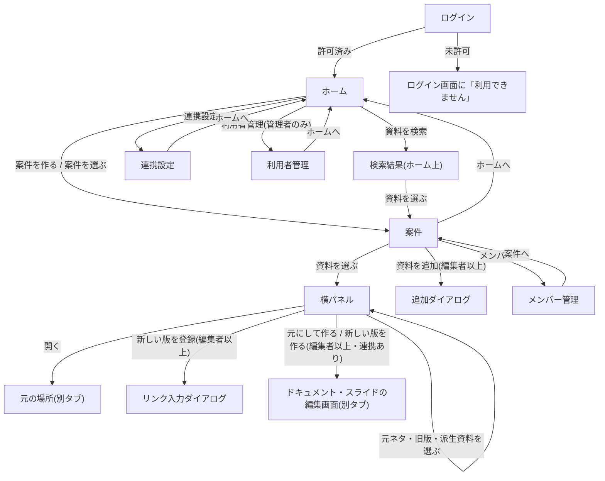

# 壁打ちメモ(Phase 1 成果物)

## コンセプトからの見直し

壁打ちの途中で、`docs/concept.md` の体験を見直した。`concept.md` は経緯の記録として書き換えず、以降のフェーズはこのメモの内容を正とする。

- 見直し前: Google ドライブの資料を後から読み、関連を自動で推測して地図に描く
- 見直し後: アプリが資料の管理を引き受け、案件・元ネタ・版を資料を作った(登録した)時点で事実として記録する
- 理由: 課題はドライブ固有ではなく、資料が増えると関連・最新版・読むべきものが分からなくなること自体にある。ドライブはその課題が起きやすい場所の一例にすぎない。書く・作る機能は Google ドキュメントやスライドなど既存の道具を借りてよく、アプリは管理に徹する
- 効果: 関連を推測しないので、見直し前の最大の不確実性(自動判定が当たるか)がなくなる。資料の本文を読む必要もなくなる

## スコープ

MVP。「案件を作る → 資料を作る・登録する(元ネタ・版を記録)→ 案件で最新版と関連を一覧で見る」までを作る。自分が日常で使えるかを最小の形で確かめるため、一覧で答えられない機能は後に回す。

- 既存の資料: リンクで1件ずつ案件に登録できる。元ネタ・版は登録するときに人が選ぶ
- ドライブ連携: 任意。つながなくても中核(案件・リンク登録・元ネタと版の記録・一覧・招待)は使える。つないだ人は、アプリから資料を作れ、資料名と更新日時を自動で取れる
- 連携なしの資料の実体: 今ある場所(ドライブ・Box・社内サーバ等)のまま。アプリは管理情報だけを持つ
- 探し方: 案件の中は資料名の絞り込みと種別フィルタ。加えて、参加しているすべての案件を対象にした資料の横断検索を持つ。検索対象は資料名(旧版の名前を含む)。本文は保存しないので本文検索はしない
- MVP 対象外: 地図表示、読む順・未読の管理、ドライブの共有設定の同期

## ロール定義

全体のロール:

| ロール | 説明 | 権限 |
|--------|------|------|
| 一般ユーザー | 自分の Google アカウントで入り、案件と資料を管理する人 | 案件の作成、参加している案件での役割に応じた操作、自分のドライブ連携のつなぐ・外す |
| 管理者 | 使える人を管理する人 | 一般ユーザーの権限 + 利用を許可する Google アカウントの追加・停止 |

案件内の役割:

| 役割 | 説明 | 権限 |
|------|------|------|
| オーナー | 案件を作った人 | 編集者の権限 + メンバーの招待・役割の変更・外す、案件の削除 |
| 編集者 | 案件の資料を管理する人 | 閲覧者の権限 + 資料の追加・登録、新しい版の登録、元にして作る |
| 閲覧者 | 案件の資料を見るだけの人 | 資料一覧と関連の閲覧、資料を開く |

- 管理者でも、参加していない案件の資料は見られない
- 役割はアプリ上の管理情報に対して効く。資料そのものを開けるかは、資料が置かれている元の場所の権限に従う
- 許可されていない Google アカウントは利用できない

## コアフロー

最も重要な体験は「探して開く」。最初の課題「何を読むべきか分からない」を直接消す流れであり、記録する側の副フローはこれを支えるために軽く作る。

```
ログイン → ホーム(参加している案件の一覧) → 案件を開く
  → 最新版を中心に資料が並ぶ(旧版は畳まれている) → 資料を選ぶ
  → 元ネタ・旧版・この資料を元にした資料をたどる → 資料を開く(元の場所で別タブ)
```

副フロー:

- 登録する: 案件で「資料を追加」→ リンクを貼る → 資料名・更新日時は連携ありなら自動、なしなら手入力 → 元ネタ・何の新しい版かを選ぶ(任意) → 一覧に並ぶ
- 元にして作る(連携ありのみ): 資料で「これを元に作る」か「新しい版を作る」→ ドキュメント・スライドが作られて編集画面が開く → 元ネタ・版は自動で記録される
- 新しい版を登録する(連携なし): 資料で「新しい版を登録」→ リンクを貼る → 版として記録される
- 招待する: 案件のメンバー管理で、許可済みの利用者を選び、役割(編集者・閲覧者)を決めて招待する

## 画面一覧

| 画面名 | 目的 | 簡易説明 | 対象ロール | 認証 |
|--------|------|----------|-----------|------|
| ログイン | 利用を始める | Google アカウントで入る。許可されていないアカウントには「利用できません」を表示する | 全員 | 不要 |
| ホーム | 案件を選ぶ・作る、資料を横断で探す | 参加している案件の一覧と「案件を作る」。検索欄から参加中の全案件の資料を資料名で検索し、結果をホーム上に一覧で出す(資料名・案件名・種別・更新日時)。連携設定への入口。管理者には利用者管理への入口も出す | 一般・管理者 | 要 |
| 案件 | 資料を探して開く | 資料を表形式のリストで並べる。1行は1系列の最新版で、列は資料名・種別・更新日時・登録した人。旧版は「旧版 n件」として行の中に畳む。上部に資料名の絞り込み欄と種別フィルタを置き、並び順の既定は更新日時の新しい順。資料を選ぶと横パネルに元ネタ・旧版・派生資料と「開く」「新しい版」「元にして作る」を出す。「資料を追加」はこの画面上のダイアログ(リンク登録、連携ありなら新しく作る) | 案件の全役割 | 要 |
| メンバー管理 | 案件の参加者を管理する | メンバーの招待・役割の変更・外す。招待できるのは許可済みの利用者だけ | オーナー(他の役割は閲覧のみ) | 要 |
| 連携設定 | ドライブ連携を管理する | ドライブ連携をつなぐ・外す | 一般・管理者 | 要 |
| 利用者管理 | 使える人を管理する | 利用を許可する Google アカウントの追加・停止 | 管理者 | 要 |

## 画面遷移の全体像



分岐条件:

- ログイン後: 許可済みならホーム、未許可ならログイン画面に「利用できません」を表示する
- 利用者管理の入口: 管理者にだけ表示する
- 横断検索の結果から資料を選ぶと、その資料の案件画面を、その資料を選んだ状態(横パネルを開いた状態)で開く。検索対象は参加している案件の資料だけ
- 変更系のボタン(資料を追加・新しい版・元にして作る): 閲覧者には表示しない
- 元にして作る・新しい版を作る: 連携ありの人にだけ表示する。連携なしの人には連携設定への案内を出す
- 招待: 招待リンクは使わない。招待された人は次にログインしたとき、ホームに案件が現れる
- 全画面共通: 「ログアウト」でログイン画面へ戻る

## データ構造(概要)

| エンティティ | 中身 | 関係 |
|-------------|------|------|
| ユーザー | Google アカウント(メール)、全体のロール(一般 / 管理者)、状態(許可済み / 停止)、ドライブ連携の有無 | 複数の案件に参加する |
| 案件 | 名前、作成日 | 複数のメンバーと複数の資料を持つ |
| 案件メンバー | ユーザーと案件の組、役割(オーナー / 編集者 / 閲覧者) | ユーザーと案件を多対多でつなぐ |
| 資料 | リンク、名前、種別、更新日時、登録した人。1つの資料は1つの版 | 1つの案件に属する |
| 関連 | 元の資料と先の資料、種類(元にした / 新しい版) | 資料どうしをつなぐ。版の系列もこれでたどる |

```
ユーザー * ── * 案件        (案件メンバーが役割を持つ)
案件 1 ── * 資料
資料 ──(関連: 元にした / 新しい版)── 資料
```

- 元ネタには他の案件の資料も選べる。その案件のメンバーでない人には「見る権限のない資料」とだけ表示する
- 資料の本文は保存しない。関連は人の記録か「元にして作る」操作で決まるので、本文を読む必要がない
- カラム定義は Phase 2 で詰める

## 保留事項・未決定事項

- 地図表示: MVP 対象外。資料が増えて一覧で追えなくなったら足す(`concept.md` の「俯瞰できる」体験)
- 読む順・未読の管理: MVP 対象外。案件に後から入った人向けの機能として判断する
- ドライブの共有設定をメンバーの役割に合わせる同期: 3つの役割とドライブの権限の対応を詰めてから判断する
- 連携なしの資料の鮮度: リンク先が更新されてもアプリには伝わらない。最新版の正しさは人の登録に頼る
- 「元にして作る」で作った資料をドライブのどこに置くか(Phase 3)
- Google ドキュメント・スライド以外(スプレッドシート・PDF 等)の資料の扱い
- 会社の Google Workspace で外部アプリ連携が制限されている場合: 中核は使えるが、連携機能は使えない
- 権限のない他案件の資料の見せ方の詳細(Phase 2)
- 案件・資料の削除、停止したユーザーのデータの扱い
